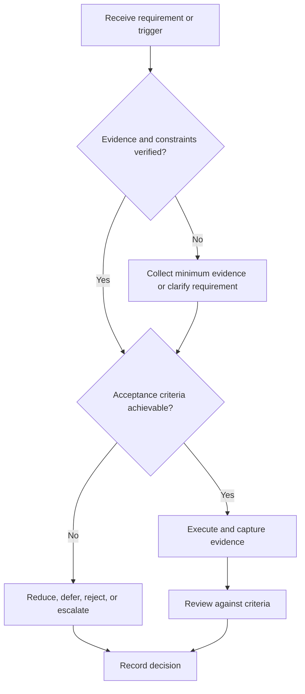

# Behavioral Interview Framework

## Purpose

Prepare concise, evidence-backed examples of professional behavior.

## Scope

The framework is role-neutral and does not script personality or fabricate experience.

## Theory

Structured interviews improve comparability when prompts, scoring dimensions, and evidence expectations are consistent.

## Framework

| Element | Operational rule |
|---|---|
| Competency | Observable behavior required by role |
| Situation | Relevant context and constraints |
| Responsibility | Personal ownership |
| Action | Specific decisions and behavior |
| Evidence | Result, artifact, feedback, or learning |
| Reflection | Limit and changed practice |

## Workflow

Map competencies; inventory real events; verify facts; structure examples; score against dimensions; practice follow-ups; retire weak or misleading stories.

## Implementation

Keep sensitive names and employer details private. Never invent results or claim team work as individual work.

## Decision Tree

Use an example only if personal contribution and evidence are clear; otherwise qualify or replace it.

## Failure Modes

Memorized monologues, vague team language, idealized hindsight, confidential disclosure, and invented metrics.

## Recovery

Return to contemporaneous records, correct attribution, shorten context, and foreground observable action.

## Examples

A project failure story names the incorrect assumption, review evidence, corrective action, and prevention change.

## Tables

The framework table is normative. Company-specific, role-specific, or
project-specific values belong in versioned configuration and records.

## Mermaid Diagrams

The decision tree defines the control path for this document.

## Cross References

- [Project Postmortem](../07-project-system/postmortem.md)
- [Mock Interviews](mock-interviews.md)
- [Identity Contract](../01-charter/identity-contract.md)

## References

- [Source register](../../references/source-register.yml)
- `SRC-NASA-SE-2016`, `SRC-ISO-29148-2018`, `SRC-CAMPION-1997`, and `SRC-GITHUB-FLOW`

## Next Steps

Add verified examples to the next mock-interview scorecard.

## Acceptance Criteria

- [x] Inputs, evidence, decisions, and recovery are explicit.
- [x] No company, salary, interview question, or hiring statistic is hardcoded.
