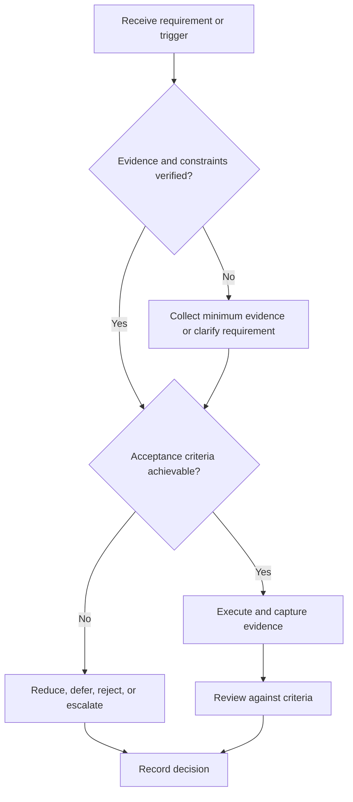

# Coding Preparation Framework

## Purpose

Build configurable coding-interview capability through implementation, testing, explanation, and review.

## Scope

No language, platform, question bank, or company process is hardcoded.

## Theory

Coding evidence includes problem representation, algorithm choice, correctness, complexity reasoning, tests, and communication.

## Framework

| Element | Operational rule |
|---|---|
| Environment | Configured language and permitted tools |
| Representation | Inputs, outputs, constraints, edge cases |
| Design | Alternatives and trade-offs |
| Implementation | Readable, correct code |
| Verification | Examples, edge cases, invariants, tests |
| Review | Complexity, defects, explanation |

## Workflow

Verify role need; diagnose; solve untimed with tests; review errors; practice mixed tasks; add time pressure; simulate communication.

## Implementation

Use version-controlled solutions with provenance and attempt history. Do not publish proprietary interview material.

## Decision Tree

Advance only when correctness and explanation are stable; speed cannot compensate for invalid code.

## Failure Modes

Memorizing solutions, coding before clarifying, omitting tests, and quoting complexity without justification.

## Recovery

Reconstruct the model, implement a smaller case, add failing tests, and retry with a new task.

## Examples

A candidate states constraints, chooses a data structure, tests empty and boundary cases, and explains trade-offs.

## Tables

The framework table is normative. Company-specific, role-specific, or
project-specific values belong in versioned configuration and records.

## Mermaid Diagrams

The decision tree defines the control path for this document.

## Cross References

- [Problem Solving](../04-study-system/problem-solving.md)
- [Mock Interviews](mock-interviews.md)
- [Core ECE Interviews](core-ece-interviews.md)

## References

- [Source register](../../references/source-register.yml)
- `SRC-NASA-SE-2016`, `SRC-ISO-29148-2018`, `SRC-CAMPION-1997`, and `SRC-GITHUB-FLOW`

## Next Steps

Integrate coding evidence into a structured mock interview.

## Acceptance Criteria

- [x] Inputs, evidence, decisions, and recovery are explicit.
- [x] No company, salary, interview question, or hiring statistic is hardcoded.
