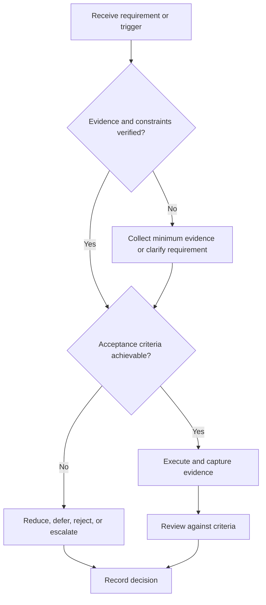

# Placement Competency Matrix

## Purpose

Map role requirements to observable capability and evidence.

## Scope

The matrix supports readiness decisions; it does not guarantee selection.

## Theory

A competency claim is credible when its context, behavior, artifact, verification, and limits are traceable.

## Framework

| Element | Operational rule |
|---|---|
| Requirement | Role-family requirement ID |
| Capability level | Unassessed, assisted, independent, transfer |
| Evidence | Assessment, project, review, or work sample |
| Freshness | Date and relevance |
| Gap | Specific missing behavior |
| Action | Learn, build, assess, communicate, or defer |

## Workflow

Import normalized requirements; map canonical concept and project evidence; rate using rubrics; identify mandatory gaps; assign bounded actions; review monthly.

## Implementation

Do not duplicate artifacts. Link to canonical project and assessment evidence.

## Decision Tree

A missing must-have blocks a strong-readiness claim; adjacent roles may remain eligible if their requirements differ.

## Failure Modes

Self-rating from confidence, counting courses as capability, hiding stale evidence, and averaging away mandatory gaps.

## Recovery

Reassess with a representative task, correct the claim, and prioritize the highest-dependency gap.

## Examples

An HDL competency links to synthesizable code, tests, timing evidence, and an explanation rather than a certificate alone.

## Tables

The framework table is normative. Company-specific, role-specific, or
project-specific values belong in versioned configuration and records.

## Mermaid Diagrams

The decision tree defines the control path for this document.

## Cross References

- [Role Targeting](role-targeting.md)
- [Resume System](resume-system.md)
- [Concept Mastery](../04-study-system/concept-mastery-rubric.md)

## References

- [Source register](../../references/source-register.yml)
- `SRC-NASA-SE-2016`, `SRC-ISO-29148-2018`, `SRC-CAMPION-1997`, and `SRC-GITHUB-FLOW`

## Next Steps

Select verified evidence for the resume and portfolio.

## Acceptance Criteria

- [x] Inputs, evidence, decisions, and recovery are explicit.
- [x] No company, salary, interview question, or hiring statistic is hardcoded.
