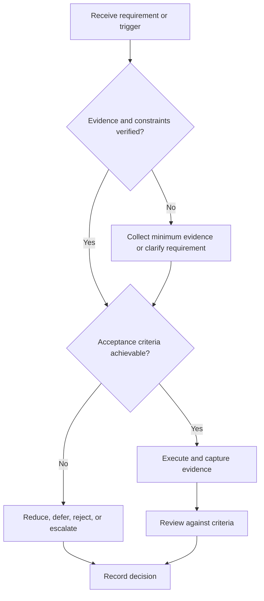

# Core Engineering Interview Framework

## Purpose

Prepare for configurable electronics and engineering interviews using concept, design, and verification evidence.

## Scope

No question list, employer pattern, or subject distribution is embedded.

## Theory

Technical interviews sample how candidates model systems, state assumptions, reason across abstractions, verify results, and communicate uncertainty.

## Framework

| Element | Operational rule |
|---|---|
| Requirement map | Role-specific engineering domains |
| Concept evidence | Mastery records |
| Design evidence | Requirements, architecture, trade-offs |
| Debug evidence | Fault isolation and tests |
| Communication | Assumptions, diagrams, units, limits |
| Calibration | Confidence versus review |

## Workflow

Map role; diagnose with representative prompts; retrieve concepts; solve and design aloud; verify; classify defects; revisit projects; simulate.

## Implementation

Build prompts from role requirements and public fundamentals, not leaked or proprietary interview questions.

## Decision Tree

If an answer relies on memorized wording without transfer, return to concept and design evidence.

## Failure Modes

Answer dumping, unstated assumptions, ignoring units and interfaces, and bluffing uncertainty.

## Recovery

State the gap, derive from fundamentals where safe, record it, remediate, and retest with a changed context.

## Examples

For an ADC interface discussion, define signal range, sampling assumptions, timing, data path, and verification approach.

## Tables

The framework table is normative. Company-specific, role-specific, or
project-specific values belong in versioned configuration and records.

## Mermaid Diagrams

The decision tree defines the control path for this document.

## Cross References

- [Competency Matrix](competency-matrix.md)
- [Project Reviews](../07-project-system/review-gates.md)
- [Mock Interviews](mock-interviews.md)

## References

- [Source register](../../references/source-register.yml)
- `SRC-NASA-SE-2016`, `SRC-ISO-29148-2018`, `SRC-CAMPION-1997`, and `SRC-GITHUB-FLOW`

## Next Steps

Run a structured technical mock.

## Acceptance Criteria

- [x] Inputs, evidence, decisions, and recovery are explicit.
- [x] No company, salary, interview question, or hiring statistic is hardcoded.
