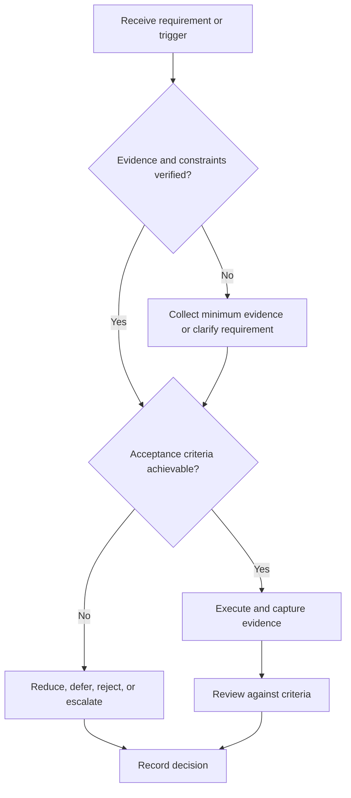

# Mock Interviews and Retrospectives

## Purpose

Simulate role-relevant interviews and convert observations into corrective actions.

## Scope

The system does not replicate a particular employer’s undisclosed process.

## Theory

A mock is useful when conditions, dimensions, observations, and reviewer evidence are standardized enough to support a decision.

## Framework

| Element | Operational rule |
|---|---|
| Blueprint | Role requirements and interview modes |
| Conditions | Time, tools, communication channel |
| Scorecard | Behavioral anchors, not overall impression |
| Evidence | Notes, code, diagrams, recording with consent |
| Retrospective | Observation, cause, action, retest |
| Ethics | Consent, privacy, no proprietary content |

## Workflow

Define blueprint; brief reviewer; run without coaching; score independently; compare evidence; select top corrections; retest later.

## Implementation

Separate interviewer behavior from candidate evidence. Keep recordings private and obtain consent.

## Decision Tree

Do not repeat a full mock while review debt remains; use targeted drills first.

## Failure Modes

Friendly unstructured feedback, scoring charisma alone, coaching mid-answer, and collecting mocks without remediation.

## Recovery

Re-score from evidence, clarify anchors, remediate one dominant defect, and run an unseen follow-up simulation.

## Examples

A technical mock reveals sound concepts but weak requirement clarification; the next drill targets clarification only.

## Tables

The framework table is normative. Company-specific, role-specific, or
project-specific values belong in versioned configuration and records.

## Mermaid Diagrams

The decision tree defines the control path for this document.

## Cross References

- [Core ECE Interviews](core-ece-interviews.md)
- [Behavioral Interviews](behavioral-interviews.md)
- [Application Pipeline](application-pipeline.md)

## References

- [Source register](../../references/source-register.yml)
- `SRC-NASA-SE-2016`, `SRC-ISO-29148-2018`, `SRC-CAMPION-1997`, and `SRC-GITHUB-FLOW`

## Next Steps

Update the competency matrix and application decision.

## Acceptance Criteria

- [x] Inputs, evidence, decisions, and recovery are explicit.
- [x] No company, salary, interview question, or hiring statistic is hardcoded.
