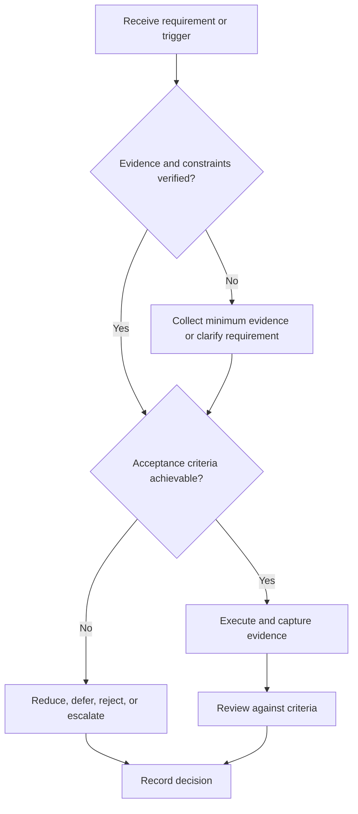

# Offer Evaluation Framework

## Purpose

Compare verified offers against constraints, role evidence, and long-term optionality.

## Scope

This is a decision framework, not legal, tax, salary, or negotiation advice.

## Theory

Offer decisions combine hard constraints, evidence quality, uncertainty, reversibility, role learning, team conditions, and total obligations.

## Framework

| Element | Operational rule |
|---|---|
| Authenticity | Written, verified offer and authorized contact |
| Hard constraints | Eligibility, safety, ethics, location, timing |
| Role content | Actual responsibilities and interfaces |
| Learning environment | Feedback, mentorship, tools, review |
| Total package | All terms interpreted with qualified advice where needed |
| Risk | Uncertainty, dependency, reversibility |

## Workflow

Verify authenticity; extract terms; list hard constraints; gather missing facts; compare weighted dimensions; run pre-mortem; seek qualified advice; decide and record.

## Implementation

Weights and personal terms remain private. Separate measured facts, assumptions, and preferences.

## Decision Tree

Reject options violating hard constraints. For close options, prefer additional evidence or a reversible decision over false precision.

## Failure Modes

Comparing headline compensation only, using unverifiable promises, ignoring role content, and rushing under artificial pressure.

## Recovery

Pause, verify with authorized parties, obtain professional advice for legal or financial terms, and rebuild the comparison.

## Examples

A lower nominal package may still score higher on role fit and verified learning conditions; the framework does not prescribe that result.

## Tables

The framework table is normative. Company-specific, role-specific, or
project-specific values belong in versioned configuration and records.

## Mermaid Diagrams

The decision tree defines the control path for this document.

## Cross References

- [Role Targeting](role-targeting.md)
- [Constraints](../01-charter/constraints.md)
- [Controllables vs Outcomes](../01-charter/controllables-vs-outcomes.md)

## References

- [Source register](../../references/source-register.yml)
- `SRC-NASA-SE-2016`, `SRC-ISO-29148-2018`, `SRC-CAMPION-1997`, and `SRC-GITHUB-FLOW`

## Next Steps

Record the decision and close affected pipeline items.

## Acceptance Criteria

- [x] Inputs, evidence, decisions, and recovery are explicit.
- [x] No company, salary, interview question, or hiring statistic is hardcoded.
