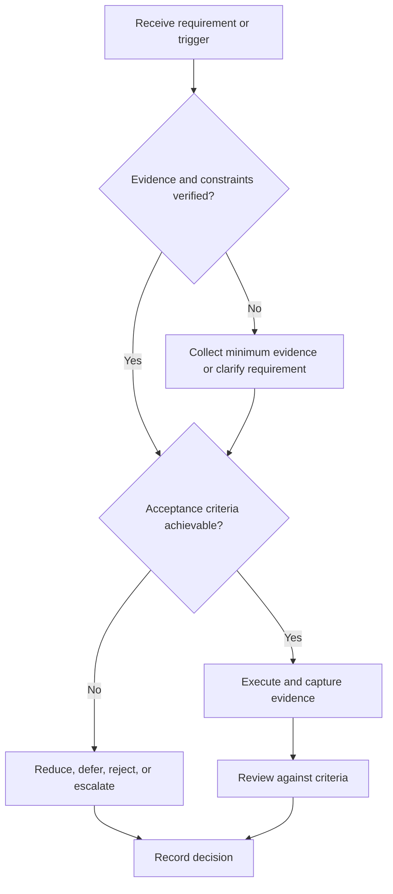

# Resume Engineering System

## Purpose

Produce a truthful, role-relevant, verifiable resume from canonical evidence.

## Scope

The framework governs content and review, not a universal visual template or employer-specific claim.

## Theory

A resume is a constrained interface: it selects evidence relevant to a role, states contribution precisely, and enables verification during interviews.

## Framework

| Element | Operational rule |
|---|---|
| Claim | Action, engineering object, context, and result |
| Evidence link | Canonical artifact or review |
| Contribution | Personal responsibility distinguished from team work |
| Metric | Used only when measured and meaningful |
| Relevance | Traceable to role requirement |
| Review | Accuracy, clarity, accessibility, and formatting |

## Workflow

Choose role family; rank evidence; draft factual bullets; verify every noun, verb, metric, and technology; peer review; export; archive version.

## Implementation

Maintain a master evidence inventory and derive targeted resumes. Never maintain conflicting factual copies.

## Decision Tree

Remove or qualify any claim that cannot survive technical questioning or evidence review.

## Failure Modes

Keyword stuffing, unsupported metrics, vague participation verbs, undisclosed team scope, and inaccessible links.

## Recovery

Correct claims, restore evidence links, simplify language, and rerun role and technical review.

## Examples

“Implemented and verified a UART receiver in RTL with self-checking tests” is stronger than “worked on FPGA.”

## Tables

The framework table is normative. Company-specific, role-specific, or
project-specific values belong in versioned configuration and records.

## Mermaid Diagrams

The decision tree defines the control path for this document.

## Cross References

- [Competency Matrix](competency-matrix.md)
- [Portfolio Strategy](../07-project-system/portfolio-strategy.md)
- [Mock Interviews](mock-interviews.md)

## References

- [Source register](../../references/source-register.yml)
- `SRC-NASA-SE-2016`, `SRC-ISO-29148-2018`, `SRC-CAMPION-1997`, and `SRC-GITHUB-FLOW`

## Next Steps

Enter the reviewed resume into the application workflow.

## Acceptance Criteria

- [x] Inputs, evidence, decisions, and recovery are explicit.
- [x] No company, salary, interview question, or hiring statistic is hardcoded.
