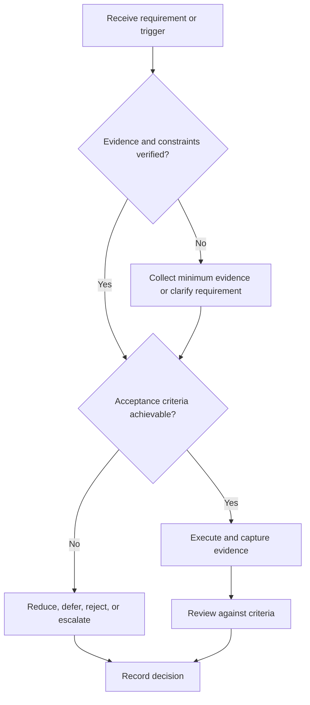

# Role Targeting

## Purpose

Select role families using verified requirements, constraints, and evidence gaps.

## Scope

The framework does not name companies, predict openings, or prescribe a recruitment cycle.

## Theory

Role targeting reduces preparation diffusion by converting market observations into testable competency hypotheses.

## Framework

| Element | Operational rule |
|---|---|
| Role family | Stable local label, not one posting |
| Requirement evidence | Repeated observations from dated sources |
| Must-have | Capability repeatedly required |
| Differentiator | Evidence that improves fit but is not universal |
| Constraint | Location, eligibility, schedule, ethics, or work type |
| Uncertainty | Confidence and review date |

## Workflow

Collect multiple current role descriptions; normalize terminology; separate recurring and employer-specific needs; map competencies; score evidence gaps; choose primary and adjacent families.

## Implementation

Archive source metadata privately where appropriate. Revalidate before each application wave.

## Decision Tree

Choose a family only when it fits hard constraints and enough evidence exists to create a bounded gap plan.

## Failure Modes

Chasing every title, copying one job description as truth, and confusing interest with fit evidence.

## Recovery

Narrow the sample, validate terminology with authoritative technical sources or practitioners, and retest the hypothesis.

## Examples

“Digital design verification” may group several titles when the underlying requirements and artifacts overlap.

## Tables

The framework table is normative. Company-specific, role-specific, or
project-specific values belong in versioned configuration and records.

## Mermaid Diagrams

The decision tree defines the control path for this document.

## Cross References

- [Competency Matrix](competency-matrix.md)
- [Application Pipeline](application-pipeline.md)
- [Constraints](../01-charter/constraints.md)

## References

- [Source register](../../references/source-register.yml)
- `SRC-NASA-SE-2016`, `SRC-ISO-29148-2018`, `SRC-CAMPION-1997`, and `SRC-GITHUB-FLOW`

## Next Steps

Build the competency matrix for selected role families.

## Acceptance Criteria

- [x] Inputs, evidence, decisions, and recovery are explicit.
- [x] No company, salary, interview question, or hiring statistic is hardcoded.
