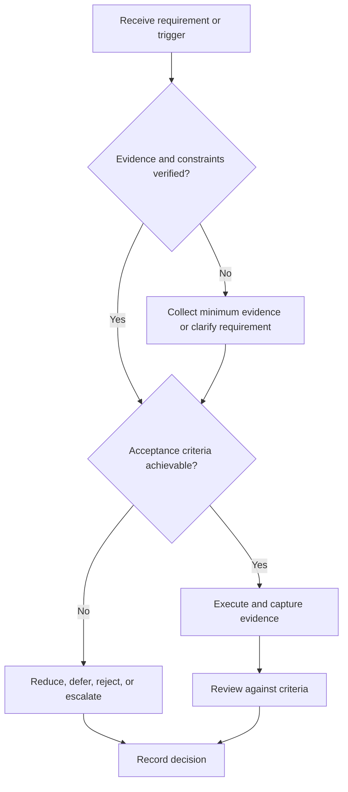

# Engineering Project System

## Purpose

Provide canonical navigation for selecting, engineering, verifying, documenting, and releasing projects.

## Scope

The system governs project evidence; it does not implement a specific project or downstream portfolio dashboard.

## Theory

Engineering projects convert requirements into verified products through architecture, controlled implementation, configuration, review, verification, validation, and closure.

## Framework

| Element | Operational rule |
|---|---|
| Select | Evidence value, feasibility, risk, and constraints |
| Specify | Stakeholders, requirements, interfaces, acceptance |
| Design | Architecture and trade-offs |
| Build | Version-controlled increments |
| Verify/validate | Requirement compliance and intended-use evidence |
| Release | Documentation, demo, limitations, postmortem |

## Workflow

Select; charter; specify; review design; implement vertical slices; test; integrate; verify; validate; release; archive and review.

## Implementation

Limit active projects to two and maintain one canonical project record.

## Decision Tree

Do not build without a bounded requirement and acceptance method; uncertain ideas enter a reversible probe.

## Failure Modes

Solution-first building, scope expansion, test debt, undocumented interfaces, and portfolio polish before verification.

## Recovery

Freeze scope, restore requirements, isolate the smallest vertical slice, close critical verification debt, and re-gate.

## Examples

A sensor node project begins with range, accuracy, interface, power, and demo criteria—not a parts list.

## Tables

The framework table is normative. Company-specific, role-specific, or
project-specific values belong in versioned configuration and records.

## Mermaid Diagrams

The decision tree defines the control path for this document.

## Cross References

- [Project Selection](project-selection.md)
- [Placement Portfolio](portfolio-strategy.md)
- [WIP Limits](../03-execution-system/work-in-progress-limits.md)

## References

- [Source register](../../references/source-register.yml)
- `SRC-NASA-SE-2016`, `SRC-ISO-29148-2018`, `SRC-CAMPION-1997`, and `SRC-GITHUB-FLOW`

## Next Steps

Evaluate candidate ideas with Project Selection.

## Acceptance Criteria

- [x] Inputs, evidence, decisions, and recovery are explicit.
- [x] No company, salary, interview question, or hiring statistic is hardcoded.

---

## Active Projects (Operational — Rounak)

### Project 1: RVS Accelerator (BTP-I)

**Status:** In Progress — Target completion: August 16, 2026
**Type:** FPGA/RTL Hardware — B.Tech Project I
**Description:** Rotation Vector Sum Accelerator implemented in Verilog. A parameterizable hardware accelerator that computes the sum of spatially rotated vectors efficiently.

| Element | Value |
|---|---|
| Repository | `github.com/rounak/rvs-accelerator` |
| Language | Verilog |
| Platform | Icarus Verilog / ModelSim |
| Target | Single demo, documented with architecture diagram + testbench |
| Portfolio value | RTL design, FPGA synthesis, hardware verification |

**Modules:**
- MAC Array (8×8, parameterizable)
- Rotation Matrix Generator
- Control Logic (FSM)
- Memory Interface (Block RAM)

**Milestones:**
| Day | Milestone |
|---|---|
| Aug 5 | GitHub setup, spec written |
| Aug 9 | MAC + Rotation + Control + Memory coded |
| Aug 16 | RVS complete: verified, documented, published |
| Aug 19 | Pipelined version |
| Aug 21 | Fixed-point quantization |
| Aug 23 | Research abstract written |

---

### Project 2: QSIF — Quantum-Inspired Spatial Intelligence Fabric (BTP-II)

**Status:** Concept Complete — FPGA implementation starting Phase 3
**Type:** Research project — B.Tech Project II
**Description:** A geometry-, physics-, and probability-native edge computing platform for autonomous cyber-physical systems.

See full specification: [QSIF-BTP-II.md](QSIF-BTP-II.md)

| Element | Value |
|---|---|
| Category | Edge AI, FPGA, Spatial Computing |
| Novelty | Quantum math + Spatial graphs + FPGA (no prior work) |
| Publication target | 1 paper by Month 6, 8 papers over 3 years |
| Startup potential | Real IP, real market (Railways, Defense, Smart Cities) |

---

### Project Principles

1. **Maximum 2 active projects** — Focus beats breadth
2. **Verification before portfolio** — No claiming what isn't proven
3. **Documentation is part of the build** — Not an afterthought
4. **Publication first, LinkedIn second** — Substance over signal

### Cross References (Updated)

- [184-Day Structure](../02-roadmap/184-DAY-STRUCTURE.md) — Project timing in phases
- [QSIF BTP-II](QSIF-BTP-II.md) — Full QSIF specification
- [Portfolio Strategy](portfolio-strategy.md) — How projects translate to career
- [Research System](../08-research-system/README.md) — Paper writing process

