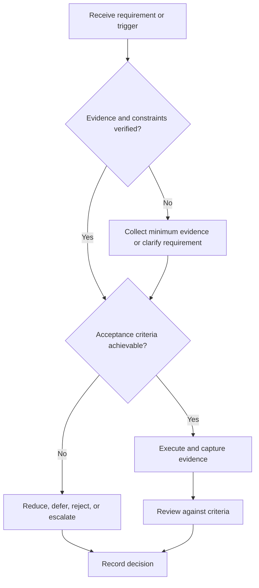

# Engineering Project System

## Purpose

Provide canonical navigation for selecting, engineering, verifying, documenting, and releasing projects.

## Scope

The system governs project evidence; it does not implement a specific project or downstream portfolio dashboard.

## Theory

Engineering projects convert requirements into verified products through architecture, controlled implementation, configuration, review, verification, validation, and closure.

## Framework

| Element | Operational rule |
|---|---|
| Select | Evidence value, feasibility, risk, and constraints |
| Specify | Stakeholders, requirements, interfaces, acceptance |
| Design | Architecture and trade-offs |
| Build | Version-controlled increments |
| Verify/validate | Requirement compliance and intended-use evidence |
| Release | Documentation, demo, limitations, postmortem |

## Workflow

Select; charter; specify; review design; implement vertical slices; test; integrate; verify; validate; release; archive and review.

## Implementation

Limit active projects to two and maintain one canonical project record.

## Decision Tree

Do not build without a bounded requirement and acceptance method; uncertain ideas enter a reversible probe.

## Failure Modes

Solution-first building, scope expansion, test debt, undocumented interfaces, and portfolio polish before verification.

## Recovery

Freeze scope, restore requirements, isolate the smallest vertical slice, close critical verification debt, and re-gate.

## Examples

A sensor node project begins with range, accuracy, interface, power, and demo criteria—not a parts list.

## Tables

The framework table is normative. Company-specific, role-specific, or
project-specific values belong in versioned configuration and records.

## Mermaid Diagrams

The decision tree defines the control path for this document.

## Cross References

- [Project Selection](project-selection.md)
- [Placement Portfolio](portfolio-strategy.md)
- [WIP Limits](../03-execution-system/work-in-progress-limits.md)

## References

- [Source register](../../references/source-register.yml)
- `SRC-NASA-SE-2016`, `SRC-ISO-29148-2018`, `SRC-CAMPION-1997`, and `SRC-GITHUB-FLOW`

## Next Steps

Evaluate candidate ideas with Project Selection.

## Acceptance Criteria

- [x] Inputs, evidence, decisions, and recovery are explicit.
- [x] No company, salary, interview question, or hiring statistic is hardcoded.
