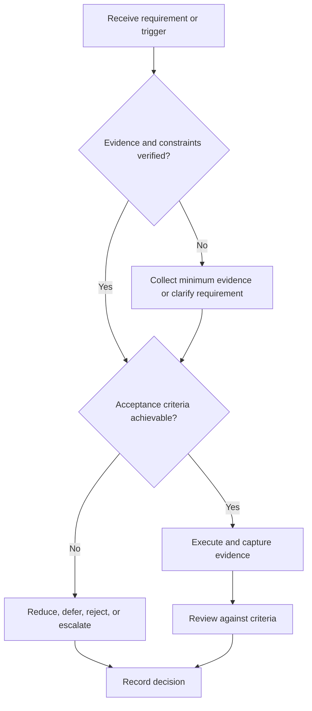

# Documentation and Demo Readiness

## Purpose

Make a project reproducible, reviewable, and accurately demonstrable.

## Scope

The protocol covers documentation, Git workflow, release evidence, and demos without prescribing one hosting platform.

## Theory

Documentation is an engineering interface. A demo is validation evidence only for the scenario it actually exercises; it does not replace requirement verification.

## Framework

| Element | Operational rule |
|---|---|
| README | Purpose, architecture, setup, use, limitations |
| Design docs | Requirements, interfaces, decisions, diagrams |
| Git workflow | Small reviewed changes, meaningful commits, protected stable branch |
| Tests | Commands, environment, expected results |
| Demo | Scenario, script, reset, failure handling, evidence capture |
| Release | Version, license, bill of materials, known defects |

## Workflow

Audit docs; reproduce from clean environment; run tests; prepare demo script; test reset and degraded paths; review claims; tag release; archive evidence.

## Implementation

Use branches as bounded change contexts, peer review where available, and keep generated binaries separate from canonical source.

## Decision Tree

Release only when setup and tests are reproducible and claims match evidence. Disclose unsupported environments.

## Failure Modes

Screenshot-only portfolios, undocumented dependencies, huge commits, rehearsed happy path only, and demo claims broader than tests.

## Recovery

Freeze release, reproduce from scratch, split defects, correct claims, and repeat the release review.

## Examples

An FPGA demo includes source, constraints, tool version, testbench, timing status, board setup, and a repeatable script.

## Tables

The framework table is normative. Company-specific, role-specific, or
project-specific values belong in versioned configuration and records.

## Mermaid Diagrams

The decision tree defines the control path for this document.

## Cross References

- [Portfolio Strategy](portfolio-strategy.md)
- [Review Gates](review-gates.md)
- [Resume System](../06-placement-system/resume-system.md)

## References

- [Source register](../../references/source-register.yml)
- `SRC-NASA-SE-2016`, `SRC-ISO-29148-2018`, `SRC-CAMPION-1997`, and `SRC-GITHUB-FLOW`

## Next Steps

Conduct the release gate and then publish portfolio evidence.

## Acceptance Criteria

- [x] Inputs, evidence, decisions, and recovery are explicit.
- [x] No company, salary, interview question, or hiring statistic is hardcoded.
