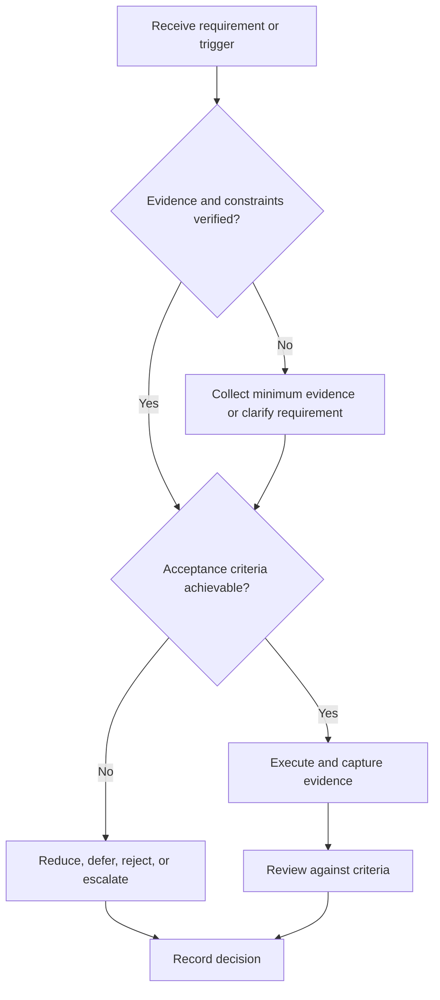

# Engineering Notebook

## Purpose

Maintain a chronological, traceable record of decisions, experiments, observations, and failures.

## Scope

The notebook supplements canonical requirements and design documents; it does not replace them.

## Theory

Contemporaneous records preserve context, support reproducibility, and distinguish observation from interpretation and decision.

## Framework

| Element | Operational rule |
|---|---|
| Timestamp | ISO date and relevant configuration |
| Objective | Question or requirement under test |
| Setup | Hardware, software, versions, instruments |
| Observation | Raw result without interpretation |
| Analysis | Reasoning and uncertainty |
| Decision | Action, owner, evidence link |
| Next test | Executable follow-up |

## Workflow

Open entry; state objective; record setup; execute; preserve raw evidence; analyze; decide; link issue/commit/test; close with next action.

## Implementation

Use append-oriented records. Correct errors transparently rather than rewriting history.

## Decision Tree

When evidence is missing, mark the conclusion unsupported and repeat the experiment before using it downstream.

## Failure Modes

Backfilling from memory, mixing raw data and conclusions, omitting versions, and storing secrets or sensitive data.

## Recovery

Reconstruct only from available evidence, label uncertainty, rerun critical tests, and correct the record visibly.

## Examples

A timing failure entry links tool version, constraints, report, suspected path, corrective commit, and retest.

## Tables

The framework table is normative. Company-specific, role-specific, or
project-specific values belong in versioned configuration and records.

## Mermaid Diagrams

The decision tree defines the control path for this document.

## Cross References

- [Requirements and Tests](requirements-and-tests.md)
- [Postmortem](postmortem.md)
- [Git Workflow](documentation-and-demo.md)

## References

- [Source register](../../references/source-register.yml)
- `SRC-NASA-SE-2016`, `SRC-ISO-29148-2018`, `SRC-CAMPION-1997`, and `SRC-GITHUB-FLOW`

## Next Steps

Use notebook evidence during the next design review.

## Acceptance Criteria

- [x] Inputs, evidence, decisions, and recovery are explicit.
- [x] No company, salary, interview question, or hiring statistic is hardcoded.
