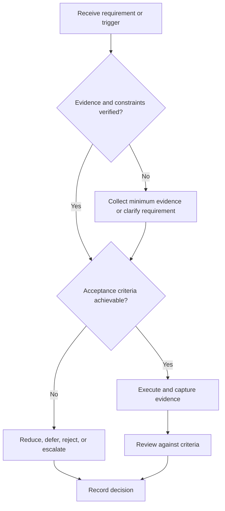

# Portfolio Strategy

## Purpose

Select and present a coherent body of verified engineering evidence.

## Scope

The strategy does not create a dashboard or prescribe one hosting platform.

## Theory

A portfolio should make capability, contribution, decisions, verification, and limitations inspectable rather than display project quantity.

## Framework

| Element | Operational rule |
|---|---|
| Narrative | Role-relevant capability progression |
| Depth project | End-to-end engineering and verification |
| Breadth probe | Bounded adjacent capability |
| Evidence | Source, tests, reports, demo |
| Contribution | Authorship and team boundaries |
| Release quality | Reproducibility, accessibility, license, limitations |

## Workflow

Choose role hypothesis; inventory artifacts; score evidence quality; select a small coherent set; close defects; create releases; review with target audience.

## Implementation

Link to canonical project evidence. Derived portfolio descriptions cannot override source records.

## Decision Tree

Exclude projects with unverifiable claims, unclear contribution, unsafe instructions, or unresolved license issues.

## Failure Modes

Many shallow projects, screenshots without source, exaggerated claims, broken setup, and hidden failures.

## Recovery

Reduce the set, repair one project to release quality, disclose limitations, and retest reproduction.

## Examples

One FPGA design with requirements, simulation, timing, hardware demo, and postmortem may carry more evidence than several tutorials.

## Tables

The framework table is normative. Company-specific, role-specific, or
project-specific values belong in versioned configuration and records.

## Mermaid Diagrams

The decision tree defines the control path for this document.

## Cross References

- [Project Lifecycle](project-lifecycle.md)
- [Resume System](../06-placement-system/resume-system.md)
- [Documentation and Demo](documentation-and-demo.md)

## References

- [Source register](../../references/source-register.yml)
- `SRC-NASA-SE-2016`, `SRC-ISO-29148-2018`, `SRC-CAMPION-1997`, and `SRC-GITHUB-FLOW`

## Next Steps

Score candidate projects using Project Selection.

## Acceptance Criteria

- [x] Inputs, evidence, decisions, and recovery are explicit.
- [x] No company, salary, interview question, or hiring statistic is hardcoded.
