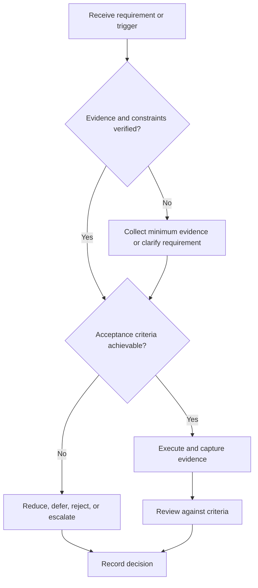

# Project Postmortem

## Purpose

Convert project outcomes, defects, and decisions into reusable process evidence.

## Scope

The postmortem is blameless and evidence-based; it does not conceal individual accountability or safety issues.

## Theory

A useful retrospective compares intended and observed system behavior, identifies contributing conditions, and assigns prevention actions with owners.

## Framework

| Element | Operational rule |
|---|---|
| Baseline | Original objectives, scope, acceptance |
| Outcome | Verified deliverables and unmet criteria |
| Timeline | Material decisions and changes |
| Causes | Technical, process, interface, capacity |
| Evidence | Tests, issues, commits, reviews |
| Actions | Keep, change, stop; owner and review date |
| Archive | Maintenance, deprecation, or continuation decision |

## Workflow

Freeze evidence; compare baseline; construct timeline; identify contributing causes; distinguish controllable and external factors; define actions; review; archive.

## Implementation

Preserve failed experiments and decision context. Reusable lessons update the applicable system, not copied advice files.

## Decision Tree

Close only when action owners and retention decisions are explicit; unresolved safety defects remain escalated.

## Failure Modes

Blame narratives, outcome bias, vague lessons, rewriting scope, and actions without owners.

## Recovery

Return to original records, separate observation from inference, test the claimed cause, and replace slogans with process changes.

## Examples

A late integration failure traces to an unreviewed interface change and produces a mandatory interface check at future design gates.

## Tables

The framework table is normative. Company-specific, role-specific, or
project-specific values belong in versioned configuration and records.

## Mermaid Diagrams

The decision tree defines the control path for this document.

## Cross References

- [Engineering Notebook](engineering-notebook.md)
- [Project Lifecycle](project-lifecycle.md)
- [Behavioral Interviews](../06-placement-system/behavioral-interviews.md)

## References

- [Source register](../../references/source-register.yml)
- `SRC-NASA-SE-2016`, `SRC-ISO-29148-2018`, `SRC-CAMPION-1997`, and `SRC-GITHUB-FLOW`

## Next Steps

Archive the project and update canonical process controls.

## Acceptance Criteria

- [x] Inputs, evidence, decisions, and recovery are explicit.
- [x] No company, salary, interview question, or hiring statistic is hardcoded.
