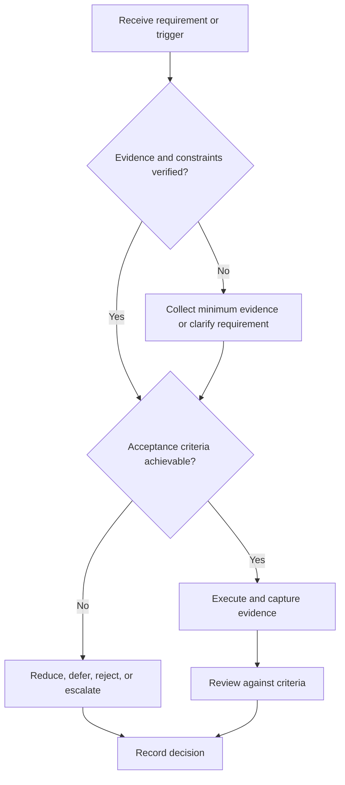

# Project Lifecycle

## Purpose

Define phase gates from idea through archive.

## Scope

The lifecycle is tailorable by risk but mandatory evidence cannot be removed silently.

## Theory

Lifecycle gates align requirements, design, realization, verification, validation, release, and learning before irreversible effort accumulates.

## Framework

| Element | Operational rule |
|---|---|
| Concept | Problem, stakeholder, constraints, feasibility |
| Requirements | Traceable and verifiable statements |
| Design | Architecture, interfaces, trade-offs, risks |
| Build | Incremental implementation and tests |
| Integration | Interface and system evidence |
| Release | Verification, validation, documentation, demo |
| Close | Postmortem, archive, maintenance decision |

## Workflow

Charter; approve requirements; review architecture; implement vertical slices; integrate; complete V&V matrix; release review; archive.

## Implementation

Each gate records evidence, reviewer, open risks, waivers, and advance/remediate/stop decision.

## Decision Tree

Advance only when mandatory exit evidence passes; schedule pressure does not waive safety or integrity.

## Failure Modes

Calendar-only gates, late testing, undocumented waivers, and projects that never enter closure.

## Recovery

Return to the earliest invalid gate, freeze dependent work, repair evidence, and repeat the affected review.

## Examples

A design review can approve a reduced interface while deferring optional telemetry with a documented scope decision.

## Tables

The framework table is normative. Company-specific, role-specific, or
project-specific values belong in versioned configuration and records.

## Mermaid Diagrams

The decision tree defines the control path for this document.

## Cross References

- [Requirements and Tests](requirements-and-tests.md)
- [Review Gates](review-gates.md)
- [Postmortem](postmortem.md)

## References

- [Source register](../../references/source-register.yml)
- `SRC-NASA-SE-2016`, `SRC-ISO-29148-2018`, `SRC-CAMPION-1997`, and `SRC-GITHUB-FLOW`

## Next Steps

Define controlled scope and requirements.

## Acceptance Criteria

- [x] Inputs, evidence, decisions, and recovery are explicit.
- [x] No company, salary, interview question, or hiring statistic is hardcoded.
