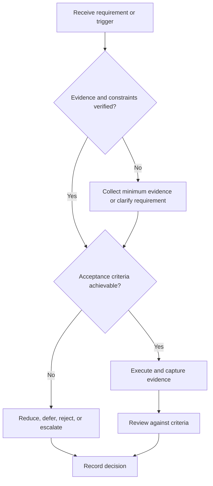

# Project Selection

## Purpose

Choose projects using evidence value, feasibility, learning leverage, and risk.

## Scope

The framework selects project hypotheses; it does not authorize unsafe or regulated work.

## Theory

Selection should compare alternatives before sunk cost, preserve reversibility, and account for verification and documentation effort.

## Framework

| Element | Operational rule |
|---|---|
| Objective fit | Charter and role competency links |
| Learning leverage | Prerequisites and transferable capability |
| Evidence value | Observable design and verification outputs |
| Feasibility | Time, equipment, skill, access |
| Risk | Safety, technical, schedule, legal, license |
| Closure cost | Test, documentation, demo, maintenance |

## Workflow

Define candidates; reject constraint violations; estimate smallest valid artifact; score with evidence; run pre-mortem; choose, probe, defer, or reject.

## Implementation

Record assumptions and kill criteria before building. Reserve capacity for verification and release.

## Decision Tree

Prefer a reversible feasibility probe when the top risk is unknown; do not start full implementation.

## Failure Modes

Choosing by novelty alone, ignoring tool access, excluding documentation effort, and maintaining an endless idea backlog as active work.

## Recovery

Stop intake, validate the highest-risk assumption, reduce scope, or select a feasible alternative.

## Examples

A processor project may be reduced to a verified instruction subset when full scope cannot fit the campaign.

## Tables

The framework table is normative. Company-specific, role-specific, or
project-specific values belong in versioned configuration and records.

## Mermaid Diagrams

The decision tree defines the control path for this document.

## Cross References

- [Scope Control](scope-control.md)
- [Capacity Model](../02-roadmap/capacity-model.md)
- [Portfolio Strategy](portfolio-strategy.md)

## References

- [Source register](../../references/source-register.yml)
- `SRC-NASA-SE-2016`, `SRC-ISO-29148-2018`, `SRC-CAMPION-1997`, and `SRC-GITHUB-FLOW`

## Next Steps

Create the project charter and lifecycle record.

## Acceptance Criteria

- [x] Inputs, evidence, decisions, and recovery are explicit.
- [x] No company, salary, interview question, or hiring statistic is hardcoded.
