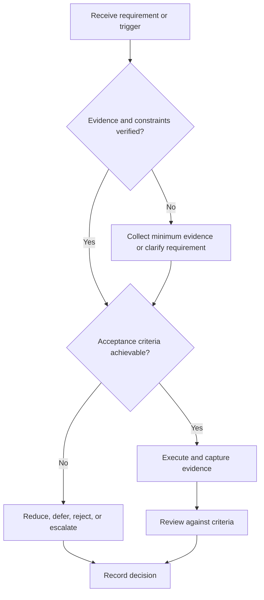

# Requirements and Tests

## Purpose

Connect stakeholder needs to clear, traceable requirements and verification evidence.

## Scope

The protocol supports software, hardware, embedded, and mixed systems; domain safety standards still apply.

## Theory

Requirements should be necessary, unambiguous, feasible, singular, verifiable, and traceable. Verification checks conformance; validation checks intended use and stakeholder need.

## Framework

| Element | Operational rule |
|---|---|
| Requirement ID | Stable, unique, versioned |
| Statement | Required behavior or quality with conditions |
| Rationale/source | Stakeholder need or constraint |
| Verification method | Analysis, inspection, demonstration, or test |
| Acceptance | Observable threshold and conditions |
| Status | Proposed, approved, verified, waived, retired |

## Workflow

Elicit needs; define operational scenarios; write requirements; review quality; create trace matrix; design tests before build; execute; preserve results; validate intended use.

## Implementation

Separate test procedure, test data, result, and disposition. Hardware tests record instruments, calibration, setup, uncertainty, and safety.

## Decision Tree

Reject unverifiable or ambiguous requirements. A failed test blocks verification until defect or requirement disposition is approved.

## Failure Modes

Using “fast” or “user-friendly” without criteria, writing tests after implementation, and confusing demonstration with complete verification.

## Recovery

Clarify stakeholder need, rewrite requirement, update trace links, design an independent test, and rerun affected evidence.

## Examples

“The receiver shall accept configured baud rates with zero frame errors over the defined test sequence” names conditions and evidence.

## Tables

The framework table is normative. Company-specific, role-specific, or
project-specific values belong in versioned configuration and records.

## Mermaid Diagrams

The decision tree defines the control path for this document.

## Cross References

- [Project Lifecycle](project-lifecycle.md)
- [Review Gates](review-gates.md)
- [Engineering Notebook](engineering-notebook.md)

## References

- [Source register](../../references/source-register.yml)
- `SRC-NASA-SE-2016`, `SRC-ISO-29148-2018`, `SRC-CAMPION-1997`, and `SRC-GITHUB-FLOW`

## Next Steps

Review architecture against the approved requirement baseline.

## Acceptance Criteria

- [x] Inputs, evidence, decisions, and recovery are explicit.
- [x] No company, salary, interview question, or hiring statistic is hardcoded.
