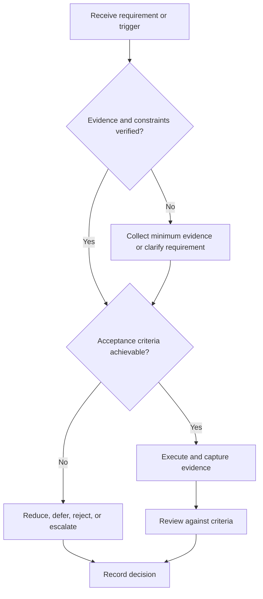

# Project Review Gates

## Purpose

Define formal technical reviews and evidence-based dispositions.

## Scope

Review depth is tailored to risk; safety-critical work requires applicable qualified review beyond this repository.

## Theory

Independent review detects requirement, interface, design, verification, and release defects before their correction cost grows.

## Framework

| Element | Operational rule |
|---|---|
| Concept review | Need, constraints, feasibility, top risks |
| Requirements review | Quality, traceability, acceptance |
| Design review | Architecture, interfaces, trade-offs, hazards |
| Test readiness | Procedures, environment, data, safety |
| Release review | V&V status, documentation, licenses, known defects |
| Close review | Postmortem and archive |

## Workflow

Prepare package; assign reviewers; review against checklist; record findings and severity; assign owners; close mandatory actions; issue disposition.

## Implementation

Dispositions are approve, approve with tracked actions, remediate, accept documented risk where permitted, or stop.

## Decision Tree

Safety, integrity, and mandatory requirement defects block advancement. Cosmetic findings do not.

## Failure Modes

Review theater, no pre-read, author-only approval, unresolved findings, and changing criteria during review.

## Recovery

Reopen the gate, restore original criteria, obtain independent evidence, close critical findings, and reissue disposition.

## Examples

A test-readiness review rejects a hardware test lacking current limits and a safe power-down procedure.

## Tables

The framework table is normative. Company-specific, role-specific, or
project-specific values belong in versioned configuration and records.

## Mermaid Diagrams

The decision tree defines the control path for this document.

## Cross References

- [Project Lifecycle](project-lifecycle.md)
- [Requirements and Tests](requirements-and-tests.md)
- [Postmortem](postmortem.md)

## References

- [Source register](../../references/source-register.yml)
- `SRC-NASA-SE-2016`, `SRC-ISO-29148-2018`, `SRC-CAMPION-1997`, and `SRC-GITHUB-FLOW`

## Next Steps

Execute the appropriate gate before dependent work.

## Acceptance Criteria

- [x] Inputs, evidence, decisions, and recovery are explicit.
- [x] No company, salary, interview question, or hiring statistic is hardcoded.
