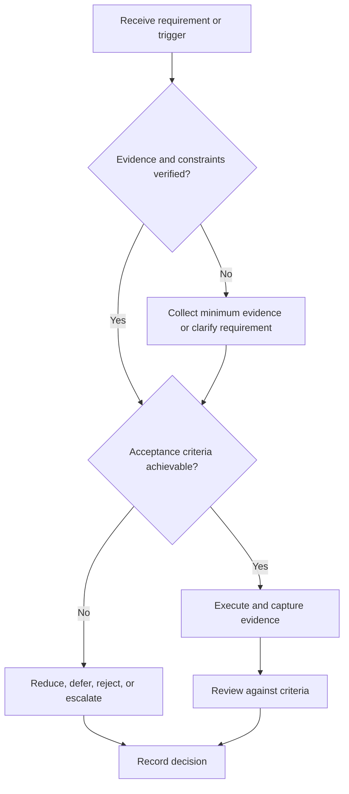

# Project Scope Control

## Purpose

Maintain a feasible baseline and control proposed changes.

## Scope

Scope control governs requirements and deliverables; ideas remain in a separate backlog.

## Theory

Uncontrolled scope changes alter schedule, risk, interfaces, tests, and evidence obligations even when each addition appears small.

## Framework

| Element | Operational rule |
|---|---|
| Baseline | Approved requirements and exclusions |
| Change request | Reason, evidence, affected artifacts |
| Impact | Capacity, interfaces, risk, tests, documentation |
| Disposition | Approve, defer, reject, experiment |
| Authority | Named reviewer or owner |
| Traceability | Version and changed links |

## Workflow

Capture request; classify mandatory or optional; analyze impact; compare capacity; decide; update baseline and dependent artifacts; communicate.

## Implementation

No verbal scope addition is active until recorded. A new feature must name displaced work or added authorized capacity.

## Decision Tree

Reject changes that break safety, acceptance, or campaign capacity. Use a time-boxed probe for uncertain high-value changes.

## Failure Modes

Gold plating, hidden requirements, treating bug fixes as features, and updating code without tests or documents.

## Recovery

Freeze intake, restore baseline, revert or isolate unauthorized work, and rerun affected reviews.

## Examples

Adding a display to an embedded project is deferred when it would displace required sensor verification.

## Tables

The framework table is normative. Company-specific, role-specific, or
project-specific values belong in versioned configuration and records.

## Mermaid Diagrams

The decision tree defines the control path for this document.

## Cross References

- [Project Selection](project-selection.md)
- [Requirements and Tests](requirements-and-tests.md)
- [WIP Limits](../03-execution-system/work-in-progress-limits.md)

## References

- [Source register](../../references/source-register.yml)
- `SRC-NASA-SE-2016`, `SRC-ISO-29148-2018`, `SRC-CAMPION-1997`, and `SRC-GITHUB-FLOW`

## Next Steps

Baseline requirements and acceptance tests.

## Acceptance Criteria

- [x] Inputs, evidence, decisions, and recovery are explicit.
- [x] No company, salary, interview question, or hiring statistic is hardcoded.
