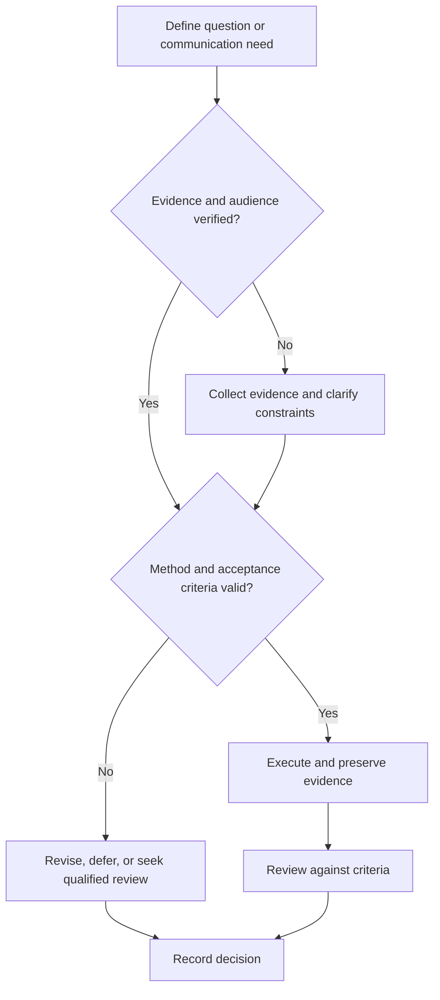

# Research System

## Purpose

Provide canonical navigation from research readiness through reproducible evidence and professional outreach.

## Scope

The system supports academic and industrial research without assuming a university, laboratory, supervisor, funder, venue, or country.

## Theory

Research is a controlled inquiry process: identify uncertainty, assess prior evidence, formulate a tractable question, select a valid method, preserve records, evaluate results, and communicate limits.

## Scientific Basis

- **Evidence:** registered empirical research, standards, or authoritative
  guidance directly supporting a claim.
- **Best practice:** a conservative workflow derived from evidence and
  engineering controls; it must be validated in the local context.
- **Opinion:** a configurable preference with no claim of general validity.

Relevant registered sources include `SRC-NASEM-2019`, `SRC-FAIR-2016`, `SRC-PRISMA-2020`, `SRC-NASA-SE-2016`, and `SRC-ISO-29148-2018`. Publication, conference,
institutional, and advisor requirements must be verified from their current
authoritative sources.

## Framework

| Element | Operational rule |
|---|---|
| Readiness | Prerequisites, ethics, resources, and supervision |
| Evidence discovery | Search, screen, read, and synthesize |
| Question | Specific, consequential, and answerable |
| Experiment | Design, controls, measurements, and analysis |
| Reproducibility | Provenance, environment, data, code, and instructions |
| Communication | Audience-appropriate claims and limitations |

## Workflow

Assess readiness; search and synthesize literature; formulate question; plan experiment; prerecord decisions where appropriate; execute; analyze; reproduce; review; communicate.

## Implementation

Use stable IDs for questions, sources, experiments, datasets, and decisions. Keep sensitive or restricted data outside public Git.

## Decision Tree

Do not begin data collection until ethical, safety, method, and resource prerequisites are satisfied.

## Failure Modes

Solution-first experiments, confirmation-only search, undocumented changes, and claims broader than evidence.

## Recovery

Freeze interpretation, restore provenance, seek appropriate review, repeat critical work where feasible, and narrow claims.

## Examples

A hardware-reliability study separates device behavior, measurement uncertainty, environmental conditions, and inference limits.

## Tables

The framework table is normative. Domain-specific and institutional values belong
in versioned project records or verified external configuration.

## Mermaid Diagrams

The decision tree defines evidence, execution, review, and recovery flow.

## Cross References

- [Research Readiness](research-readiness.md)
- [Literature Search](literature-search.md)
- [Communication System](../09-communication-system/README.md)

## References

- [Source register](../../references/source-register.yml)
- `SRC-NASEM-2019`, `SRC-FAIR-2016`, `SRC-PRISMA-2020`, `SRC-NASA-SE-2016`, and `SRC-ISO-29148-2018`

## Further Reading

Review domain-specific research ethics, safety, and reporting guidance before use.

## Next Steps

Complete the Research Readiness gate.

## Acceptance Criteria

- [x] Evidence, best practice, and opinion are distinguishable.
- [x] Mutable external requirements are not fabricated.
