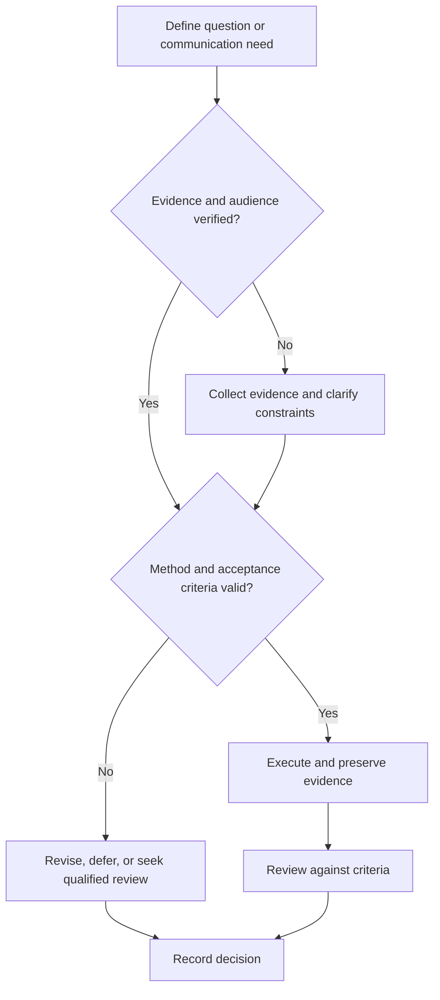

# Advisor and Research Outreach Communication

## Purpose

Create professional, evidence-based outreach, supervision updates, publication preparation, and conference-readiness workflows.

## Scope

No professor expectation, university policy, publication venue, authorship rule, conference process, or funding opportunity is assumed.

## Theory

Effective research communication minimizes recipient effort by matching audience, purpose, evidence, decision request, and constraints.

## Scientific Basis

- **Evidence:** registered empirical research, standards, or authoritative
  guidance directly supporting a claim.
- **Best practice:** a conservative workflow derived from evidence and
  engineering controls; it must be validated in the local context.
- **Opinion:** a configurable preference with no claim of general validity.

Relevant registered sources include `SRC-NASEM-2019`, `SRC-FAIR-2016`, `SRC-PRISMA-2020`, `SRC-NASA-SE-2016`, and `SRC-ISO-29148-2018`. Publication, conference,
institutional, and advisor requirements must be verified from their current
authoritative sources.

## Framework

| Element | Operational rule |
|---|---|
| Outreach | Specific fit based on verified current work |
| Update | Progress, evidence, blockers, decisions needed |
| Meeting | Agenda, pre-read, notes, actions |
| Authorship | Discuss contributions and applicable policy early |
| Publication | Select venue only after checking current scope and rules |
| Conference | Verify format, deadlines, travel, ethics, and permissions |
| Knowledge transfer | Archive context, artifacts, decisions, and open risks |

## Workflow

Research recipient or venue; verify current information; define purpose; assemble minimal evidence; draft; review tone and claims; send; log response and next action.

## Implementation

Use a concise subject, contextual opening, evidence links, bounded request, availability, and professional close. Protect confidential work.

## Decision Tree

Do not send when fit is generic, claims are unsupported, confidential disclosure is unauthorized, or requirements are unverified.

## Failure Modes

Mass outreach, excessive autobiography, assumed funding, hidden attachments, unclear request, and treating nonresponse as rejection evidence.

## Recovery

Correct the target list, narrow the message, verify public work, request feedback from a trusted reviewer, and follow up only when appropriate.

## Examples

A research update states the question, completed experiment, key result with uncertainty, blocking decision, and two proposed options.

## Tables

The framework table is normative. Domain-specific and institutional values belong
in versioned project records or verified external configuration.

## Mermaid Diagrams

The decision tree defines evidence, execution, review, and recovery flow.

## Cross References

- [Professional Correspondence](../09-communication-system/professional-correspondence.md)
- [Research Readiness](research-readiness.md)
- [Presentation Practice](../09-communication-system/presentation-practice.md)

## References

- [Source register](../../references/source-register.yml)
- `SRC-NASEM-2019`, `SRC-FAIR-2016`, `SRC-PRISMA-2020`, `SRC-NASA-SE-2016`, and `SRC-ISO-29148-2018`

## Further Reading

Consult current venue, institution, authorship, and conference rules before action.

## Next Steps

Prepare the next decision-focused research update.

## Acceptance Criteria

- [x] Evidence, best practice, and opinion are distinguishable.
- [x] Mutable external requirements are not fabricated.
