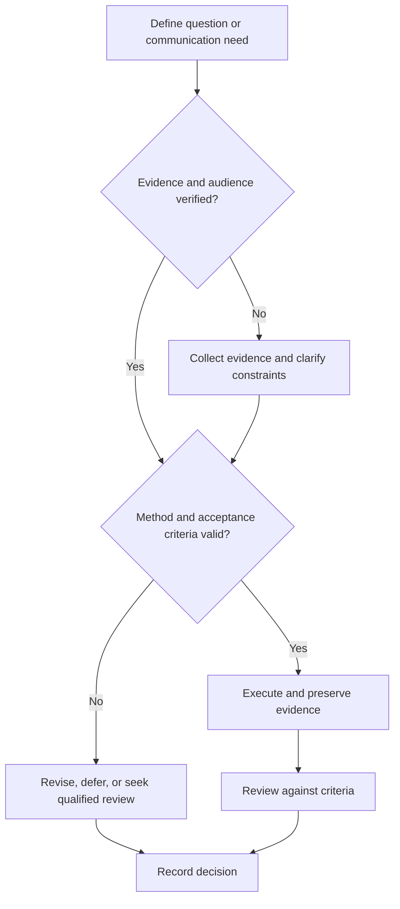

# Experiment Design

## Purpose

Design experiments that can answer the research question with traceable validity and uncertainty.

## Scope

The protocol is domain-neutral; statistical, safety, and ethical methods require qualified domain review.

## Theory

Experimental credibility depends on alignment among question, operational definitions, controls, sampling, measurement, analysis, and inference.

## Scientific Basis

- **Evidence:** registered empirical research, standards, or authoritative
  guidance directly supporting a claim.
- **Best practice:** a conservative workflow derived from evidence and
  engineering controls; it must be validated in the local context.
- **Opinion:** a configurable preference with no claim of general validity.

Relevant registered sources include `SRC-NASEM-2019`, `SRC-FAIR-2016`, `SRC-PRISMA-2020`, `SRC-NASA-SE-2016`, and `SRC-ISO-29148-2018`. Publication, conference,
institutional, and advisor requirements must be verified from their current
authoritative sources.

## Framework

| Element | Operational rule |
|---|---|
| Design | Experimental unit, conditions, control, randomization/blinding where applicable |
| Measurement | Instrument, calibration, resolution, uncertainty |
| Sampling | Population, inclusion, replication, independence |
| Confounders | Known alternative explanations and controls |
| Analysis | Predefined transformations, models, exclusions, missing data |
| Validity | Internal, construct, external, and conclusion limits |
| Change control | Deviations logged before outcome inspection where possible |

## Workflow

Define causal or descriptive aim; choose design; identify variables and confounders; plan measurements; estimate resources; define analysis; review ethics/safety; pilot; freeze protocol.

## Implementation

Create experiment ID, versioned protocol, materials/configuration, data schema, analysis environment, and deviation log.

## Decision Tree

Do not run the main experiment when instruments, controls, independence, or analysis assumptions are invalid.

## Failure Modes

Pseudoreplication, changing metrics after results, missing calibration, uncontrolled software versions, and confusing correlation with causation.

## Recovery

Quarantine invalid data, document deviation, repair design, rerun a pilot, and narrow inference if repetition is impossible.

## Examples

An FPGA power comparison fixes workload and timing constraints, calibrates measurement, records temperature, repeats units, and reports uncertainty.

## Tables

The framework table is normative. Domain-specific and institutional values belong
in versioned project records or verified external configuration.

## Mermaid Diagrams

The decision tree defines evidence, execution, review, and recovery flow.

## Cross References

- [Research Notebook](research-notebook.md)
- [Reproducibility](reproducibility.md)
- [Project Requirements](../07-project-system/requirements-and-tests.md)

## References

- [Source register](../../references/source-register.yml)
- `SRC-NASEM-2019`, `SRC-FAIR-2016`, `SRC-PRISMA-2020`, `SRC-NASA-SE-2016`, and `SRC-ISO-29148-2018`

## Further Reading

Consult current statistical and domain experimental-design references before execution.

## Next Steps

Open the research notebook and run the pilot.

## Acceptance Criteria

- [x] Evidence, best practice, and opinion are distinguishable.
- [x] Mutable external requirements are not fabricated.
