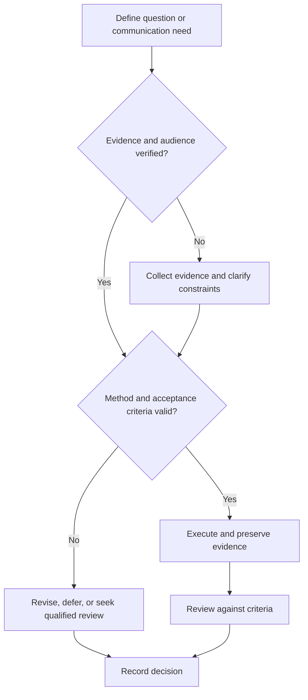

# Literature Search and Synthesis

## Purpose

Create a transparent search, screening, citation, and synthesis workflow.

## Scope

The framework supports exploratory, scoping, and systematic searches; it does not label a review systematic unless its applicable methodology is met.

## Theory

Search quality depends on explicit questions, source coverage, reproducible queries, screening criteria, evidence appraisal, and synthesis that preserves disagreement.

## Scientific Basis

- **Evidence:** registered empirical research, standards, or authoritative
  guidance directly supporting a claim.
- **Best practice:** a conservative workflow derived from evidence and
  engineering controls; it must be validated in the local context.
- **Opinion:** a configurable preference with no claim of general validity.

Relevant registered sources include `SRC-NASEM-2019`, `SRC-FAIR-2016`, `SRC-PRISMA-2020`, `SRC-NASA-SE-2016`, and `SRC-ISO-29148-2018`. Publication, conference,
institutional, and advisor requirements must be verified from their current
authoritative sources.

## Framework

| Element | Operational rule |
|---|---|
| Question | Population/system, concept, context, outcome as appropriate |
| Sources | Databases, standards, patents, repositories, citation chains |
| Query | Exact string, filters, date, platform |
| Screening | Predetermined inclusion and exclusion rules |
| Appraisal | Design, bias, relevance, directness, and uncertainty |
| Synthesis | Claims, convergence, conflict, gaps, and limitations |
| Citation | Stable identifier, version, access date, supported claim |

## Workflow

Define review type; construct concepts and synonyms; pilot query; run and log searches; deduplicate; screen; read; appraise; synthesize; update.

## Implementation

Maintain a reading queue with priority, reason, status, and next action. Use citation software as a convenience, not the source of truth.

## Decision Tree

If search coverage or screening validity is unknown, label the synthesis exploratory and avoid completeness claims.

## Failure Modes

Searching one platform, cherry-picking supportive papers, storing PDFs without metadata, and merging evidence tiers.

## Recovery

Reopen the protocol, expand sources and synonyms, document exclusions, reassess bias, and rewrite claims.

## Examples

Conflicting benchmark studies are grouped by workload, hardware, and measurement method before conclusions are compared.

## Tables

The framework table is normative. Domain-specific and institutional values belong
in versioned project records or verified external configuration.

## Mermaid Diagrams

The decision tree defines evidence, execution, review, and recovery flow.

## Cross References

- [Paper Reading](paper-reading.md)
- [Question Formulation](question-formulation.md)
- [Source Register](../../references/source-register.yml)

## References

- [Source register](../../references/source-register.yml)
- `SRC-NASEM-2019`, `SRC-FAIR-2016`, `SRC-PRISMA-2020`, `SRC-NASA-SE-2016`, and `SRC-ISO-29148-2018`

## Further Reading

Use PRISMA reporting only when its scope fits the review; consult domain-specific review guidance.

## Next Steps

Read the highest-priority included sources with the Paper Reading workflow.

## Acceptance Criteria

- [x] Evidence, best practice, and opinion are distinguishable.
- [x] Mutable external requirements are not fabricated.
