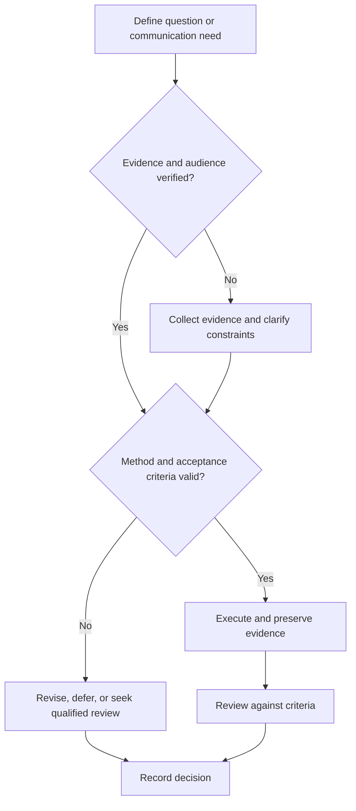

# Paper Reading Workflow

## Purpose

Extract, evaluate, and connect claims from technical papers and standards.

## Scope

The workflow supports multiple publication types and never treats peer review as proof of correctness.

## Theory

Efficient reading separates relevance screening from close appraisal and distinguishes author claims, reported evidence, and reader inference.

## Scientific Basis

- **Evidence:** registered empirical research, standards, or authoritative
  guidance directly supporting a claim.
- **Best practice:** a conservative workflow derived from evidence and
  engineering controls; it must be validated in the local context.
- **Opinion:** a configurable preference with no claim of general validity.

Relevant registered sources include `SRC-NASEM-2019`, `SRC-FAIR-2016`, `SRC-PRISMA-2020`, `SRC-NASA-SE-2016`, and `SRC-ISO-29148-2018`. Publication, conference,
institutional, and advisor requirements must be verified from their current
authoritative sources.

## Framework

| Element | Operational rule |
|---|---|
| Pass 1 | Question, contribution, venue/type, relevance |
| Pass 2 | Method, data, figures, assumptions, definitions |
| Pass 3 | Reconstruct analysis, verify key derivations or code where feasible |
| Claim ledger | Claim → evidence → limitation |
| Quality | Validity threats, bias, uncertainty, reproducibility |
| Connections | Agreements, conflicts, prerequisites, open questions |

## Workflow

Screen metadata and abstract; inspect figures and conclusion; decide priority; read method and results; reconstruct critical claim; capture note; update synthesis.

## Implementation

Use one canonical paper note with DOI or identifier, version, access date, evidence tier, and supported claims.

## Decision Tree

Stop deep reading when the source is irrelevant, superseded, or methodologically incapable of answering the target question; retain the reason.

## Failure Modes

Reading linearly by default, copying abstracts, accepting plots without axes or uncertainty, and citing sources not read.

## Recovery

Return to the research question, isolate the decisive claim, obtain missing methods or data, and qualify interpretation.

## Examples

A paper reporting accelerator speedup is evaluated against baseline implementation, workload, precision, power, and measurement conditions.

## Tables

The framework table is normative. Domain-specific and institutional values belong
in versioned project records or verified external configuration.

## Mermaid Diagrams

The decision tree defines evidence, execution, review, and recovery flow.

## Cross References

- [Literature Search](literature-search.md)
- [Research Notebook](research-notebook.md)
- [Technical Writing](../09-communication-system/technical-writing.md)

## References

- [Source register](../../references/source-register.yml)
- `SRC-NASEM-2019`, `SRC-FAIR-2016`, `SRC-PRISMA-2020`, `SRC-NASA-SE-2016`, and `SRC-ISO-29148-2018`

## Further Reading

Consult current field-specific critical-appraisal tools where applicable.

## Next Steps

Integrate the paper into the evidence synthesis or close it with a reason.

## Acceptance Criteria

- [x] Evidence, best practice, and opinion are distinguishable.
- [x] Mutable external requirements are not fabricated.
