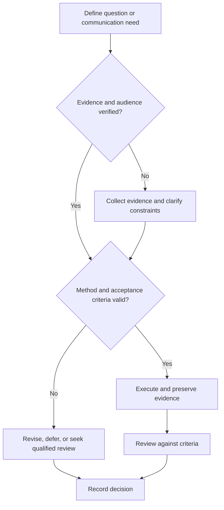

# Research Question Formulation

## Purpose

Convert an observed gap into a specific, ethical, answerable research question and testable hypothesis where appropriate.

## Scope

Not every research design requires a hypothesis; exploratory and design research may use objectives or propositions.

## Theory

A useful question connects prior evidence, a meaningful uncertainty, measurable constructs, feasible methods, and bounded inference.

## Scientific Basis

- **Evidence:** registered empirical research, standards, or authoritative
  guidance directly supporting a claim.
- **Best practice:** a conservative workflow derived from evidence and
  engineering controls; it must be validated in the local context.
- **Opinion:** a configurable preference with no claim of general validity.

Relevant registered sources include `SRC-NASEM-2019`, `SRC-FAIR-2016`, `SRC-PRISMA-2020`, `SRC-NASA-SE-2016`, and `SRC-ISO-29148-2018`. Publication, conference,
institutional, and advisor requirements must be verified from their current
authoritative sources.

## Framework

| Element | Operational rule |
|---|---|
| Gap | What is unknown and how that was established |
| Object | System, population, artifact, or phenomenon |
| Constructs | Operational definitions and measurement |
| Comparison | Baseline, control, alternative, or reference |
| Outcome | Observable evidence and uncertainty |
| Boundary | Context where inference is intended |
| Hypothesis | Directional or relational prediction when justified |

## Workflow

Observe gap; search literature; define constructs; test novelty and consequence; assess feasibility and ethics; formulate question; derive predictions; peer review.

## Implementation

Maintain a question record with rationale, prior evidence, assumptions, alternatives, success criteria, and stop conditions.

## Decision Tree

Reject questions that are unmeasurable, unethical, already answered for the intended context, or too broad for capacity.

## Failure Modes

Starting from a preferred answer, vague verbs such as improve, conflating engineering objective and scientific claim, and moving endpoints after results.

## Recovery

Narrow context, operationalize one construct, choose a valid comparison, and prerecord changes before new evidence.

## Examples

Instead of “Is architecture A better?”, ask under which defined workloads, resources, and metrics A differs from baseline B.

## Tables

The framework table is normative. Domain-specific and institutional values belong
in versioned project records or verified external configuration.

## Mermaid Diagrams

The decision tree defines evidence, execution, review, and recovery flow.

## Cross References

- [Literature Search](literature-search.md)
- [Experiment Design](experiment-design.md)
- [Controllables](../01-charter/controllables-vs-outcomes.md)

## References

- [Source register](../../references/source-register.yml)
- `SRC-NASEM-2019`, `SRC-FAIR-2016`, `SRC-PRISMA-2020`, `SRC-NASA-SE-2016`, and `SRC-ISO-29148-2018`

## Further Reading

Study current methodological guidance for the selected research design.

## Next Steps

Create the experiment plan and validation argument.

## Acceptance Criteria

- [x] Evidence, best practice, and opinion are distinguishable.
- [x] Mutable external requirements are not fabricated.
