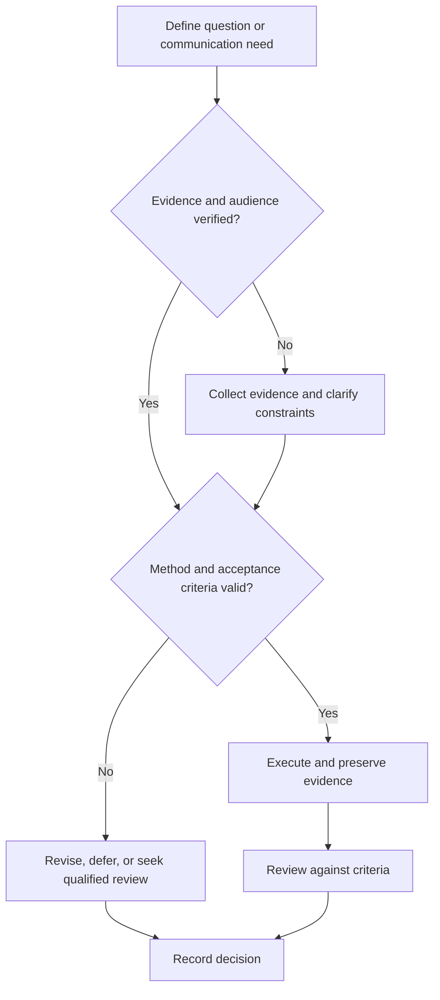

# Reproducibility and Research Data Management

## Purpose

Preserve sufficient provenance, data, code, environment, and instructions for independent checking and reuse where permitted.

## Scope

The protocol does not require public release when privacy, safety, license, consent, security, or contractual constraints prohibit it.

## Theory

Reproducibility and replicability address different aspects of obtaining consistent computational or empirical results; transparent provenance enables both assessment and correction.

## Scientific Basis

- **Evidence:** registered empirical research, standards, or authoritative
  guidance directly supporting a claim.
- **Best practice:** a conservative workflow derived from evidence and
  engineering controls; it must be validated in the local context.
- **Opinion:** a configurable preference with no claim of general validity.

Relevant registered sources include `SRC-NASEM-2019`, `SRC-FAIR-2016`, `SRC-PRISMA-2020`, `SRC-NASA-SE-2016`, and `SRC-ISO-29148-2018`. Publication, conference,
institutional, and advisor requirements must be verified from their current
authoritative sources.

## Framework

| Element | Operational rule |
|---|---|
| Identity | Persistent IDs for study, dataset, code, and release |
| Provenance | Origin, transformations, operators, timestamps |
| Environment | Hardware, software, dependencies, configuration, seeds |
| Data | Raw, interim, derived separation and immutable checksums |
| Code | Version control, tests, executable analysis |
| Metadata | Schema, units, missing values, license, access |
| Reproduction | Clean-room instructions and expected results |

## Workflow

Plan data lifecycle; create schemas; capture raw data immutably; version code/config; automate analysis; test from clean environment; archive with access controls.

## Implementation

Apply FAIR principles progressively where lawful and appropriate. Publish metadata even when data access must be controlled, if permitted.

## Decision Tree

A result is release-ready only when its provenance and analysis can be reconstructed or limitations are explicit.

## Failure Modes

Editing raw data, missing units, undocumented exclusions, environment drift, inaccessible dependencies, and sharing restricted data.

## Recovery

Freeze affected claims, recover from source, rebuild provenance, rerun analysis, and issue a corrected version.

## Examples

A benchmark release includes raw logs, parser version, configuration, derived table, plotting code, checksums, and reproduction command.

## Tables

The framework table is normative. Domain-specific and institutional values belong
in versioned project records or verified external configuration.

## Mermaid Diagrams

The decision tree defines evidence, execution, review, and recovery flow.

## Cross References

- [Experiment Design](experiment-design.md)
- [Research Notebook](research-notebook.md)
- [Project Documentation](../07-project-system/documentation-and-demo.md)

## References

- [Source register](../../references/source-register.yml)
- `SRC-NASEM-2019`, `SRC-FAIR-2016`, `SRC-PRISMA-2020`, `SRC-NASA-SE-2016`, and `SRC-ISO-29148-2018`

## Further Reading

Read the NASEM reproducibility report and FAIR principles; apply domain repository guidance.

## Next Steps

Conduct an independent reproduction check before communication.

## Acceptance Criteria

- [x] Evidence, best practice, and opinion are distinguishable.
- [x] Mutable external requirements are not fabricated.
