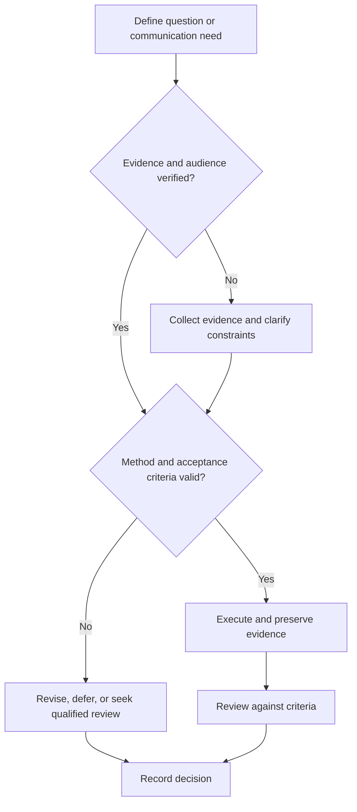

# Research Notebook

## Purpose

Maintain chronological records of questions, protocols, observations, deviations, analyses, and decisions.

## Scope

The notebook is not the canonical location for datasets, code, requirements, or final papers; it links them.

## Theory

Contemporaneous, append-oriented records preserve provenance and reduce hindsight reconstruction.

## Scientific Basis

- **Evidence:** registered empirical research, standards, or authoritative
  guidance directly supporting a claim.
- **Best practice:** a conservative workflow derived from evidence and
  engineering controls; it must be validated in the local context.
- **Opinion:** a configurable preference with no claim of general validity.

Relevant registered sources include `SRC-NASEM-2019`, `SRC-FAIR-2016`, `SRC-PRISMA-2020`, `SRC-NASA-SE-2016`, and `SRC-ISO-29148-2018`. Publication, conference,
institutional, and advisor requirements must be verified from their current
authoritative sources.

## Framework

| Element | Operational rule |
|---|---|
| Entry | Timestamp, author, study and experiment IDs |
| Objective | Question and planned decision |
| Configuration | Protocol, materials, software, instruments |
| Observation | Raw result separated from interpretation |
| Deviation | What changed, why, authorization, impact |
| Analysis | Method, uncertainty, alternative explanations |
| Decision | Claim status, next action, owner |

## Workflow

Open entry before work; link protocol; record setup; execute; preserve raw evidence; note deviations; analyze; decide; close with next action.

## Implementation

Use ISO dates, stable IDs, immutable evidence links, and visible corrections. Store sensitive records in approved private systems.

## Decision Tree

Unsupported conclusions remain hypotheses. Critical missing provenance triggers repetition or claim withdrawal.

## Failure Modes

Backfilling from memory, mixing observation and interpretation, overwriting failed trials, and storing credentials or personal data.

## Recovery

Label uncertainty, reconstruct only from evidence, repeat critical measurements, and correct the record transparently.

## Examples

An unexpected waveform is logged with instrument settings, probe placement, raw capture, suspected mechanism, and next test.

## Tables

The framework table is normative. Domain-specific and institutional values belong
in versioned project records or verified external configuration.

## Mermaid Diagrams

The decision tree defines evidence, execution, review, and recovery flow.

## Cross References

- [Experiment Design](experiment-design.md)
- [Reproducibility](reproducibility.md)
- [Engineering Notebook](../07-project-system/engineering-notebook.md)

## References

- [Source register](../../references/source-register.yml)
- `SRC-NASEM-2019`, `SRC-FAIR-2016`, `SRC-PRISMA-2020`, `SRC-NASA-SE-2016`, and `SRC-ISO-29148-2018`

## Further Reading

Consult applicable laboratory notebook, intellectual-property, and retention policies.

## Next Steps

Use notebook evidence in the research review.

## Acceptance Criteria

- [x] Evidence, best practice, and opinion are distinguishable.
- [x] Mutable external requirements are not fabricated.
