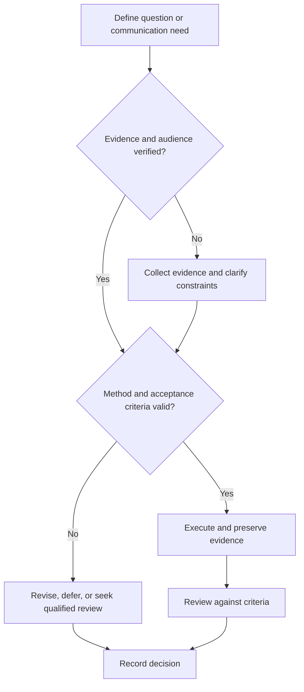

# Research Readiness

## Purpose

Verify that a proposed inquiry has sufficient prerequisites, authority, resources, and safeguards.

## Scope

This gate does not replace institutional ethics, safety, legal, export-control, privacy, or intellectual-property review.

## Theory

Readiness is multidimensional: domain knowledge alone cannot compensate for invalid methods, unavailable instrumentation, missing permissions, or unsafe work.

## Scientific Basis

- **Evidence:** registered empirical research, standards, or authoritative
  guidance directly supporting a claim.
- **Best practice:** a conservative workflow derived from evidence and
  engineering controls; it must be validated in the local context.
- **Opinion:** a configurable preference with no claim of general validity.

Relevant registered sources include `SRC-NASEM-2019`, `SRC-FAIR-2016`, `SRC-PRISMA-2020`, `SRC-NASA-SE-2016`, and `SRC-ISO-29148-2018`. Publication, conference,
institutional, and advisor requirements must be verified from their current
authoritative sources.

## Framework

| Element | Operational rule |
|---|---|
| Knowledge | Prerequisite concept and method evidence |
| Supervision | Qualified review appropriate to risk |
| Ethics | Human, animal, privacy, consent, authorship, and conflicts checked |
| Safety | Hazards and controls reviewed |
| Resources | Time, equipment, software, access, and maintenance |
| Data | Collection, retention, access, and disposal plan |
| Output | Question, acceptance criteria, and intended communication |

## Workflow

Describe inquiry; classify risk; map prerequisites; identify required approvals; verify resources; draft data and reproducibility plans; conduct readiness review.

## Implementation

Record `ready`, `conditional`, `blocked`, or `not-applicable` for each dimension with evidence and reviewer.

## Decision Tree

Any missing mandatory approval, unsafe condition, invalid method, or unverifiable resource blocks execution.

## Failure Modes

Treating curiosity as authorization, assuming public data are unrestricted, and beginning before measurement capability is verified.

## Recovery

Pause work, obtain qualified guidance, reduce scope to a safe non-sensitive pilot, and repeat the gate.

## Examples

A benchmark using public data still verifies license, provenance, compute environment, and intended claims.

## Tables

The framework table is normative. Domain-specific and institutional values belong
in versioned project records or verified external configuration.

## Mermaid Diagrams

The decision tree defines evidence, execution, review, and recovery flow.

## Cross References

- [Question Formulation](question-formulation.md)
- [Experiment Design](experiment-design.md)
- [Safety Policy](../../governance/safety-and-escalation-policy.md)

## References

- [Source register](../../references/source-register.yml)
- `SRC-NASEM-2019`, `SRC-FAIR-2016`, `SRC-PRISMA-2020`, `SRC-NASA-SE-2016`, and `SRC-ISO-29148-2018`

## Further Reading

Consult current domain and institutional requirements from authoritative sources.

## Next Steps

Start the literature search only after the gate is passed.

## Acceptance Criteria

- [x] Evidence, best practice, and opinion are distinguishable.
- [x] Mutable external requirements are not fabricated.
