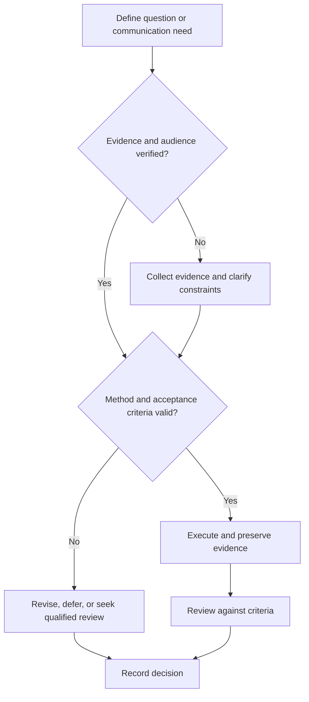

# Technical Communication System

## Purpose

Provide canonical navigation for writing, speaking, design review, correspondence, and communication quality control.

## Scope

The system covers reusable communication mechanics; venue-specific formatting and institutional policy remain external.

## Theory

Technical communication is an engineered interface between evidence and a defined audience decision.

## Scientific Basis

- **Evidence:** registered empirical research, standards, or authoritative
  guidance directly supporting a claim.
- **Best practice:** a conservative workflow derived from evidence and
  engineering controls; it must be validated in the local context.
- **Opinion:** a configurable preference with no claim of general validity.

Relevant registered sources include `SRC-NASEM-2019`, `SRC-FAIR-2016`, `SRC-PRISMA-2020`, `SRC-NASA-SE-2016`, and `SRC-ISO-29148-2018`. Publication, conference,
institutional, and advisor requirements must be verified from their current
authoritative sources.

## Framework

| Element | Operational rule |
|---|---|
| Audience | Knowledge, responsibility, constraints, decision |
| Purpose | Inform, instruct, request, recommend, or record |
| Evidence | Traceable claims and limitations |
| Structure | Progressive disclosure and explicit logic |
| Representation | Text, table, figure, equation, diagram, or demonstration |
| Review | Technical, editorial, accessibility, and action closure |

## Workflow

Define audience and decision; collect evidence; choose artifact; outline; draft; review; revise; publish; capture feedback and archive.

## Implementation

Use canonical evidence links and approved templates. Do not duplicate requirements or project facts in communication artifacts.

## Decision Tree

If audience, purpose, evidence, or required action is unclear, do not draft the full artifact.

## Failure Modes

Writing before purpose, excessive detail, unsupported certainty, inaccessible visuals, and no review disposition.

## Recovery

Return to audience and decision, rebuild the evidence map, simplify structure, and repeat technical and editorial review.

## Examples

A design memo leads with the decision, constraints, alternatives, evidence, recommendation, and open risks.

## Tables

The framework table is normative. Domain-specific and institutional values belong
in versioned project records or verified external configuration.

## Mermaid Diagrams

The decision tree defines evidence, execution, review, and recovery flow.

## Cross References

- [Technical Writing](technical-writing.md)
- [Communication Rubric](communication-rubric.md)
- [Research System](../08-research-system/README.md)

## References

- [Source register](../../references/source-register.yml)
- `SRC-NASEM-2019`, `SRC-FAIR-2016`, `SRC-PRISMA-2020`, `SRC-NASA-SE-2016`, and `SRC-ISO-29148-2018`

## Further Reading

Review the repository documentation and diagram standards.

## Next Steps

Select the required communication artifact.

## Acceptance Criteria

- [x] Evidence, best practice, and opinion are distinguishable.
- [x] Mutable external requirements are not fabricated.
