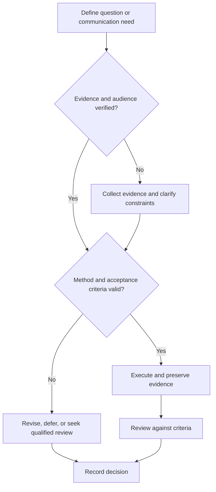

# Communication Review Rubric

## Purpose

Evaluate technical artifacts consistently across accuracy, evidence, audience fit, structure, visuals, accessibility, and action.

## Scope

The rubric supports improvement and release decisions; it does not measure personal worth or replace domain approval.

## Theory

A multidimensional rubric makes review criteria explicit and prevents polish from masking technical defects.

## Scientific Basis

- **Evidence:** registered empirical research, standards, or authoritative
  guidance directly supporting a claim.
- **Best practice:** a conservative workflow derived from evidence and
  engineering controls; it must be validated in the local context.
- **Opinion:** a configurable preference with no claim of general validity.

Relevant registered sources include `SRC-NASEM-2019`, `SRC-FAIR-2016`, `SRC-PRISMA-2020`, `SRC-NASA-SE-2016`, and `SRC-ISO-29148-2018`. Publication, conference,
institutional, and advisor requirements must be verified from their current
authoritative sources.

## Framework

| Element | Operational rule |
|---|---|
| 0 — Blocking | Absent, false, unsafe, or unusable |
| 1 — Fragile | Major gaps require reconstruction |
| 2 — Functional | Purpose served with bounded defects |
| 3 — Strong | Accurate, clear, traceable, audience-ready |
| Accuracy | Claims, calculations, terminology, units |
| Evidence | Traceability, uncertainty, limitations |
| Structure | Purpose, logic, navigation, action |
| Visual/accessibility | Legibility, alternatives, non-color cues |
| Professional quality | Tone, attribution, privacy, format, version |

## Workflow

Define artifact and audience; score dimensions independently; cite findings; classify severity; revise; rescore; record release disposition.

## Implementation

Mandatory dimensions are accuracy, evidence, safety, privacy, and accessibility. Overall status cannot exceed a blocking mandatory dimension.

## Decision Tree

Release at the configured threshold only after technical and editorial reviewers close mandatory findings.

## Failure Modes

Averaging away false claims, scoring aesthetics first, vague feedback, inconsistent reviewers, and no retest.

## Recovery

Return to evidence and audience, rewrite the blocking section, calibrate reviewers on examples, and rescore.

## Examples

A visually polished report with an unsupported conclusion scores blocking on evidence and cannot pass.

## Tables

The framework table is normative. Domain-specific and institutional values belong
in versioned project records or verified external configuration.

## Mermaid Diagrams

The decision tree defines evidence, execution, review, and recovery flow.

## Cross References

- [Technical Writing](technical-writing.md)
- [Presentation Practice](presentation-practice.md)
- [Design Review](design-review.md)

## References

- [Source register](../../references/source-register.yml)
- `SRC-NASEM-2019`, `SRC-FAIR-2016`, `SRC-PRISMA-2020`, `SRC-NASA-SE-2016`, and `SRC-ISO-29148-2018`

## Further Reading

Consult the repository editorial, Markdown, diagram, and accessibility standards.

## Next Steps

Apply the rubric to the next technical artifact.

## Acceptance Criteria

- [x] Evidence, best practice, and opinion are distinguishable.
- [x] Mutable external requirements are not fabricated.
