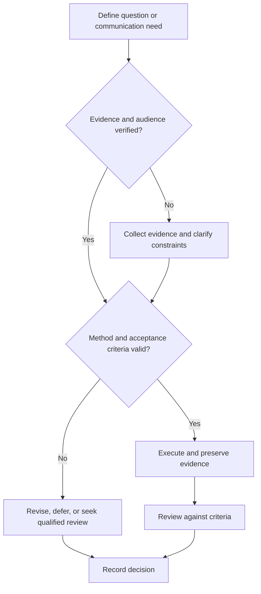

# Design Review Communication

## Purpose

Structure technical reviews so evidence leads to explicit findings and decisions.

## Scope

This document governs review communication; project gate authority remains in the Project System.

## Theory

A review succeeds when participants share the baseline, inspect evidence against criteria, record dissent and findings, and assign dispositions.

## Scientific Basis

- **Evidence:** registered empirical research, standards, or authoritative
  guidance directly supporting a claim.
- **Best practice:** a conservative workflow derived from evidence and
  engineering controls; it must be validated in the local context.
- **Opinion:** a configurable preference with no claim of general validity.

Relevant registered sources include `SRC-NASEM-2019`, `SRC-FAIR-2016`, `SRC-PRISMA-2020`, `SRC-NASA-SE-2016`, and `SRC-ISO-29148-2018`. Publication, conference,
institutional, and advisor requirements must be verified from their current
authoritative sources.

## Framework

| Element | Operational rule |
|---|---|
| Charter | Decision, scope, criteria, authority |
| Pre-read | Requirements, design, evidence, risks, open questions |
| Presentation | Decision-focused, not document narration |
| Finding | Evidence, consequence, severity, owner |
| Disposition | Approve, action, remediate, accept risk, or stop |
| Record | Minutes, decisions, actions, due dates |

## Workflow

Issue charter and pre-read; verify reviewer independence; present baseline and deltas; inspect evidence; capture findings; decide; circulate record; close actions.

## Implementation

Use a finding log with IDs. Meeting notes distinguish discussion, decision, action, owner, and deadline.

## Decision Tree

A mandatory evidence gap blocks approval; disagreement is recorded rather than averaged away.

## Failure Modes

Surprise reviews, slide-only evidence, unresolved verbal actions, authority ambiguity, and suppressing dissent.

## Recovery

Pause disposition, provide missing evidence, clarify authority, reconvene affected reviewers, and issue a corrected record.

## Examples

A timing review records the failing path, constraint, consequence, corrective owner, and verification action.

## Tables

The framework table is normative. Domain-specific and institutional values belong
in versioned project records or verified external configuration.

## Mermaid Diagrams

The decision tree defines evidence, execution, review, and recovery flow.

## Cross References

- [Project Review Gates](../07-project-system/review-gates.md)
- [Technical Writing](technical-writing.md)
- [Communication Rubric](communication-rubric.md)

## References

- [Source register](../../references/source-register.yml)
- `SRC-NASEM-2019`, `SRC-FAIR-2016`, `SRC-PRISMA-2020`, `SRC-NASA-SE-2016`, and `SRC-ISO-29148-2018`

## Further Reading

Consult domain-specific peer-review and safety-review guidance.

## Next Steps

Close findings in the canonical project record.

## Acceptance Criteria

- [x] Evidence, best practice, and opinion are distinguishable.
- [x] Mutable external requirements are not fabricated.
