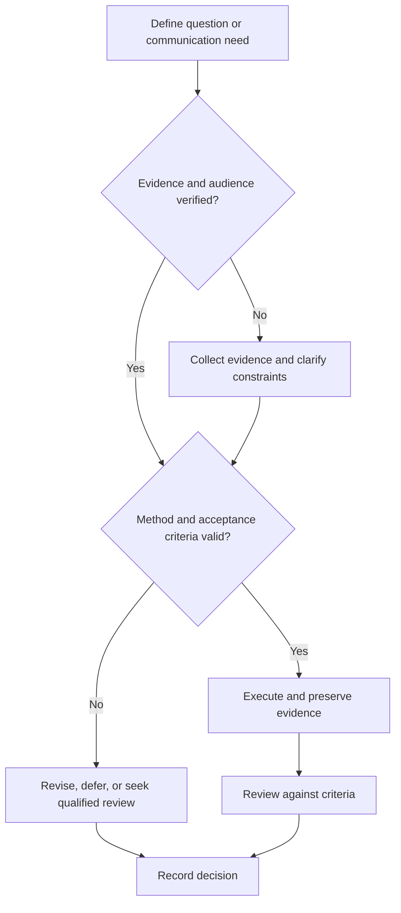

# Technical Presentation Design and Review

## Purpose

Design presentations that make a technical argument legible, verifiable, and accessible.

## Scope

The system is tool-neutral and does not assume conference templates, branding, or timing.

## Theory

Visuals should reduce cognitive translation by aligning each slide, figure, and demonstration with one audience question.

## Scientific Basis

- **Evidence:** registered empirical research, standards, or authoritative
  guidance directly supporting a claim.
- **Best practice:** a conservative workflow derived from evidence and
  engineering controls; it must be validated in the local context.
- **Opinion:** a configurable preference with no claim of general validity.

Relevant registered sources include `SRC-NASEM-2019`, `SRC-FAIR-2016`, `SRC-PRISMA-2020`, `SRC-NASA-SE-2016`, and `SRC-ISO-29148-2018`. Publication, conference,
institutional, and advisor requirements must be verified from their current
authoritative sources.

## Framework

| Element | Operational rule |
|---|---|
| Message | One audience-relevant claim or decision per section |
| Evidence | Readable figures, units, uncertainty, source |
| Flow | Problem, method, result, limitation, action |
| Figures | Purposeful encoding, caption, legend, scale |
| Diagrams | Defined nodes, interfaces, direction, prose alternative |
| Demo | Scenario, reset, fallback, claim boundary |
| Review | Technical accuracy, accessibility, timing, questions |

## Workflow

Define audience; storyboard; select evidence; create figures; draft minimal text; verify claims; rehearse; peer review; test venue and fallback.

## Implementation

Export a stable version and archive source. Use alt text or prose alternatives where delivery medium supports them.

## Decision Tree

Remove visuals that do not support the objective. Do not enlarge claims to create a stronger narrative.

## Failure Modes

Tiny plots, decorative diagrams, screenshots of text, unexplained color, live-demo dependence, and conclusions unsupported by figures.

## Recovery

Return to the evidence table, redraw the decisive figure, simplify flow, prepare static fallback, and retest timing.

## Examples

A benchmark slide shows axes, units, workload, baseline, variability, and limitation before stating the comparison.

## Tables

The framework table is normative. Domain-specific and institutional values belong
in versioned project records or verified external configuration.

## Mermaid Diagrams

The decision tree defines evidence, execution, review, and recovery flow.

## Cross References

- [Speaking Practice](speaking-practice.md)
- [Communication Rubric](communication-rubric.md)
- [Research Outreach](../08-research-system/advisor-communication.md)

## References

- [Source register](../../references/source-register.yml)
- `SRC-NASEM-2019`, `SRC-FAIR-2016`, `SRC-PRISMA-2020`, `SRC-NASA-SE-2016`, and `SRC-ISO-29148-2018`

## Further Reading

Consult current venue, accessibility, and figure-submission requirements.

## Next Steps

Run a recorded rehearsal and structured review.

## Acceptance Criteria

- [x] Evidence, best practice, and opinion are distinguishable.
- [x] Mutable external requirements are not fabricated.
