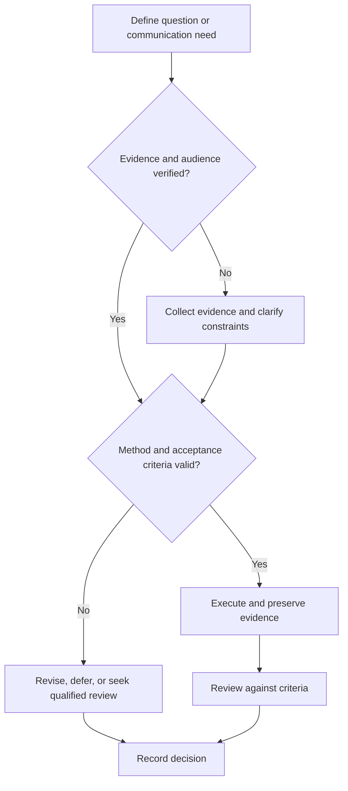

# Professional Correspondence

## Purpose

Create concise, respectful email and message records that enable a clear action.

## Scope

The framework is culture- and organization-neutral; local norms, privacy, retention, and legal rules must be verified.

## Theory

Professional correspondence reduces coordination cost by stating context, request, evidence, owner, timing, and next step without unnecessary disclosure.

## Scientific Basis

- **Evidence:** registered empirical research, standards, or authoritative
  guidance directly supporting a claim.
- **Best practice:** a conservative workflow derived from evidence and
  engineering controls; it must be validated in the local context.
- **Opinion:** a configurable preference with no claim of general validity.

Relevant registered sources include `SRC-NASEM-2019`, `SRC-FAIR-2016`, `SRC-PRISMA-2020`, `SRC-NASA-SE-2016`, and `SRC-ISO-29148-2018`. Publication, conference,
institutional, and advisor requirements must be verified from their current
authoritative sources.

## Framework

| Element | Operational rule |
|---|---|
| Subject | Specific topic and action |
| Opening | Relevant context and relationship |
| Body | Purpose, minimum evidence, decision or request |
| Action | Owner, requested response, date when justified |
| Attachments | Named, accessible, necessary, non-sensitive |
| Close | Professional acknowledgement and contact |
| Record | Decision and action transferred to canonical system |

## Workflow

Verify recipient and authority; define outcome; draft concise message; check claims and confidentiality; verify links/attachments; send; log action; follow up appropriately.

## Implementation

Use channels appropriate to sensitivity and urgency. Email is not a substitute for emergency or safety escalation.

## Decision Tree

Do not send when recipient, authority, confidential status, or request is unclear.

## Failure Modes

Vague subject, excessive background, hidden request, accusatory tone, reply-all misuse, and sensitive attachments.

## Recovery

Pause, correct recipient and facts, move sensitive content to approved channels, apologize plainly when necessary, and restate action.

## Examples

A meeting follow-up lists the approved decision, two actions with owners and dates, and a link to canonical minutes.

## Tables

The framework table is normative. Domain-specific and institutional values belong
in versioned project records or verified external configuration.

## Mermaid Diagrams

The decision tree defines evidence, execution, review, and recovery flow.

## Cross References

- [Advisor Communication](../08-research-system/advisor-communication.md)
- [Design Review](design-review.md)
- [Communication Rubric](communication-rubric.md)

## References

- [Source register](../../references/source-register.yml)
- `SRC-NASEM-2019`, `SRC-FAIR-2016`, `SRC-PRISMA-2020`, `SRC-NASA-SE-2016`, and `SRC-ISO-29148-2018`

## Further Reading

Consult local communication, records-retention, accessibility, and privacy policies.

## Next Steps

Transfer decisions and actions to their canonical records.

## Acceptance Criteria

- [x] Evidence, best practice, and opinion are distinguishable.
- [x] Mutable external requirements are not fabricated.
