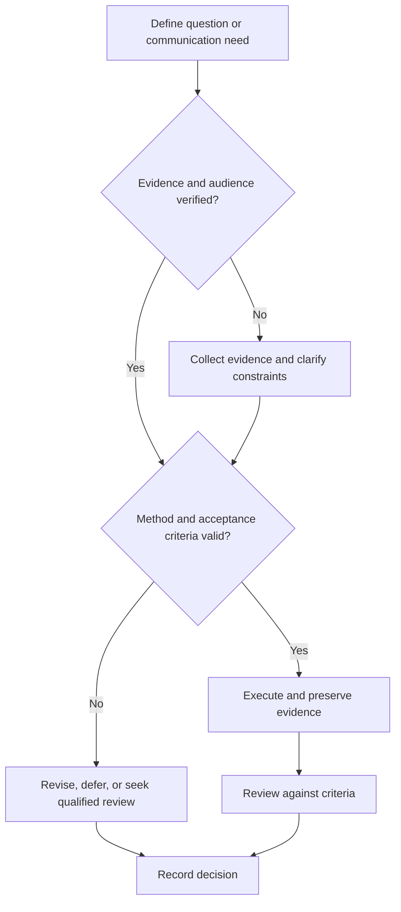

# Public Speaking Practice

## Purpose

Develop clear, evidence-based technical speaking through deliberate rehearsal and feedback.

## Scope

The protocol is format-neutral and does not prescribe a presentation duration or venue.

## Theory

Speaking competence combines audience modeling, structure, explanation, visual coordination, timing, question handling, and calibrated uncertainty.

## Scientific Basis

- **Evidence:** registered empirical research, standards, or authoritative
  guidance directly supporting a claim.
- **Best practice:** a conservative workflow derived from evidence and
  engineering controls; it must be validated in the local context.
- **Opinion:** a configurable preference with no claim of general validity.

Relevant registered sources include `SRC-NASEM-2019`, `SRC-FAIR-2016`, `SRC-PRISMA-2020`, `SRC-NASA-SE-2016`, and `SRC-ISO-29148-2018`. Publication, conference,
institutional, and advisor requirements must be verified from their current
authoritative sources.

## Framework

| Element | Operational rule |
|---|---|
| Objective | What the audience should understand or decide |
| Structure | Opening, logic, evidence, close |
| Explanation | Definitions, analogy limits, transitions |
| Delivery | Pace, volume, pauses, attention |
| Questions | Clarify, answer, qualify, follow up |
| Evidence | Recording, rubric, reviewer notes, retest |

## Workflow

Define audience; create one-sentence objective; outline; rehearse without slides; add visuals; record; score; repair one defect; retest.

## Implementation

Practice under representative conditions. Obtain consent before recording others or sharing rehearsal media.

## Decision Tree

Advance when the message fits the configured time and rubric; content defects outrank delivery polish.

## Failure Modes

Memorizing every sentence, reading slides, rushing, hiding uncertainty, and rehearsing repeatedly without feedback.

## Recovery

Return to the message spine, remove secondary detail, rehearse one transition or answer, and repeat with a new reviewer.

## Examples

A speaker who lacks one result states the limitation and follow-up rather than improvising unsupported evidence.

## Tables

The framework table is normative. Domain-specific and institutional values belong
in versioned project records or verified external configuration.

## Mermaid Diagrams

The decision tree defines evidence, execution, review, and recovery flow.

## Cross References

- [Presentation Practice](presentation-practice.md)
- [Communication Rubric](communication-rubric.md)
- [Mock Interviews](../06-placement-system/mock-interviews.md)

## References

- [Source register](../../references/source-register.yml)
- `SRC-NASEM-2019`, `SRC-FAIR-2016`, `SRC-PRISMA-2020`, `SRC-NASA-SE-2016`, and `SRC-ISO-29148-2018`

## Further Reading

Study current accessibility and venue guidance before delivery.

## Next Steps

Build and review the presentation artifact.

## Acceptance Criteria

- [x] Evidence, best practice, and opinion are distinguishable.
- [x] Mutable external requirements are not fabricated.
