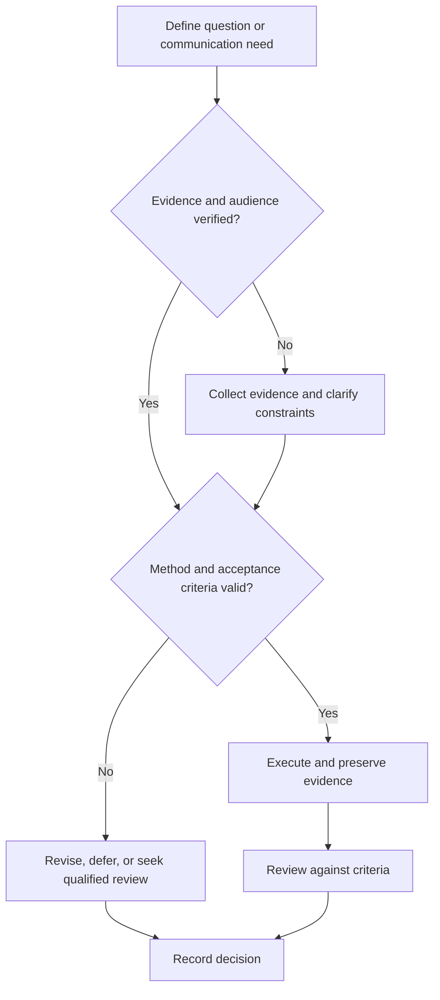

# Technical and Engineering Writing

## Purpose

Produce accurate requirements, design documents, lab reports, and technical reports for decision and reuse.

## Scope

The framework does not replace domain templates, journal instructions, contractual formats, or regulated documentation.

## Theory

Strong technical writing makes claim structure, evidence, assumptions, uncertainty, and action visible to the intended reader.

## Scientific Basis

- **Evidence:** registered empirical research, standards, or authoritative
  guidance directly supporting a claim.
- **Best practice:** a conservative workflow derived from evidence and
  engineering controls; it must be validated in the local context.
- **Opinion:** a configurable preference with no claim of general validity.

Relevant registered sources include `SRC-NASEM-2019`, `SRC-FAIR-2016`, `SRC-PRISMA-2020`, `SRC-NASA-SE-2016`, and `SRC-ISO-29148-2018`. Publication, conference,
institutional, and advisor requirements must be verified from their current
authoritative sources.

## Framework

| Element | Operational rule |
|---|---|
| Purpose | Reader decision or task |
| Front matter | Title, status, version, owner, scope |
| Context | Problem, stakeholders, constraints, definitions |
| Method/design | Reproducible procedure or architecture |
| Results | Observed evidence separate from interpretation |
| Discussion | Meaning, limitations, alternatives, risks |
| Action | Recommendation, owner, acceptance, next step |

## Workflow

Define audience; create evidence outline; select document type; draft figures and tables early; write; verify claims; edit structure; review; release.

## Implementation

Requirements use stable IDs and verification methods. Lab reports preserve setup and uncertainty. Design documents record alternatives and interfaces.

## Decision Tree

Reject release when claims lack evidence, results and interpretation are mixed, or instructions cannot be followed.

## Failure Modes

Chronological lab narration, vague requirements, unsupported adjectives, hidden assumptions, and citations detached from claims.

## Recovery

Restore evidence map, rewrite around reader decisions, qualify uncertainty, and rerun technical and editorial checks.

## Examples

A technical report separates measured timing data from the inference about architectural bottlenecks.

## Tables

The framework table is normative. Domain-specific and institutional values belong
in versioned project records or verified external configuration.

## Mermaid Diagrams

The decision tree defines evidence, execution, review, and recovery flow.

## Cross References

- [Communication Rubric](communication-rubric.md)
- [Project Requirements](../07-project-system/requirements-and-tests.md)
- [Research Notebook](../08-research-system/research-notebook.md)

## References

- [Source register](../../references/source-register.yml)
- `SRC-NASEM-2019`, `SRC-FAIR-2016`, `SRC-PRISMA-2020`, `SRC-NASA-SE-2016`, and `SRC-ISO-29148-2018`

## Further Reading

Consult the current applicable engineering, publisher, or organizational style guide.

## Next Steps

Run a design or editorial review appropriate to risk.

## Acceptance Criteria

- [x] Evidence, best practice, and opinion are distinguishable.
- [x] Mutable external requirements are not fabricated.
