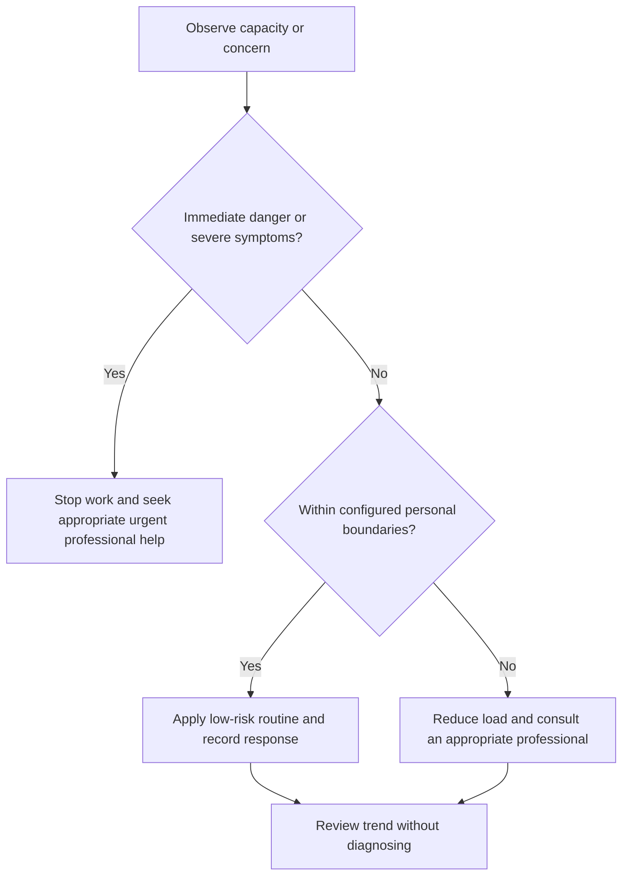

# Health System

## Purpose

Provide canonical navigation for general health-capacity observation, low-risk routines, and professional escalation.

## Scope

This educational system does not diagnose, treat, prescribe, recommend supplements, or replace qualified healthcare.

## Theory

Health constrains engineering capacity. The system therefore protects recovery, records trends privately, and adjusts workload without converting observations into medical conclusions.

## Scientific Basis

- **Evidence:** current registered public-health guidance or peer-reviewed
  evidence directly supporting a population-level claim.
- **Best practice:** conservative system design derived from evidence and local
  observation; it is not individualized clinical advice.
- **Opinion:** an operator preference recorded as configuration, not a health
  claim.

Relevant registered sources include `SRC-WHO-ACTIVITY-2020`, `SRC-WHO-DIET-2026`, `SRC-CDC-SLEEP`, and `SRC-WHO-STRESS-2020`. Individual needs vary with age,
health, disability, pregnancy, medication, environment, and professional advice.

## Framework

| Element | Operational rule |
|---|---|
| Observe | Sleep opportunity, activity, fatigue, discomfort, environment, stress |
| Protect | Recovery and safety boundaries |
| Adjust | Reduce workload or environmental demand |
| Escalate | Use appropriate clinical or emergency care |
| Privacy | Store personal data privately |
| Review | Trends support planning, not diagnosis |

## Workflow

Establish professional boundaries; configure private observations; operate sleep, activity, nutrition, ergonomics, and fatigue protocols; escalate concerns; review capacity.

## Implementation

Use minimum necessary data and record only what changes a planning or care-seeking decision.

## Decision Tree

Safety, acute symptoms, functional deterioration, or professional instructions override the campaign schedule.

## Failure Modes

Optimizing metrics, self-diagnosis, copying generic targets into personal prescriptions, and publishing sensitive data.

## Recovery

Stop load escalation, restore basic routines, seek appropriate professional guidance, and rebaseline capacity.

## Examples

Repeated exhaustion reduces planned work and triggers professional consultation rather than a more aggressive productivity plan.

## Tables

The framework table is normative. Sensitive observations belong in private
storage and are never used to diagnose a condition.

## Mermaid Diagrams

The decision tree places safety and professional escalation before productivity.

## Cross References

- [Scope and Safety](scope-and-safety.md)
- [Nutrition Basics](nutrition-basics.md)
- [Fatigue Monitoring](fatigue-monitoring.md)
- [Resilience System](../11-resilience-system/README.md)

## References

- [Source register](../../references/source-register.yml)
- `SRC-WHO-ACTIVITY-2020`, `SRC-WHO-DIET-2026`, `SRC-CDC-SLEEP`, and `SRC-WHO-STRESS-2020`

## Further Reading

Consult current local public-health and healthcare guidance appropriate to the individual.

## Next Steps

Read Scope and Safety before using any health protocol.

## Acceptance Criteria

- [x] Educational and professional-care boundaries are explicit.
- [x] No diagnosis, treatment, supplement, or prescription instruction is given.
