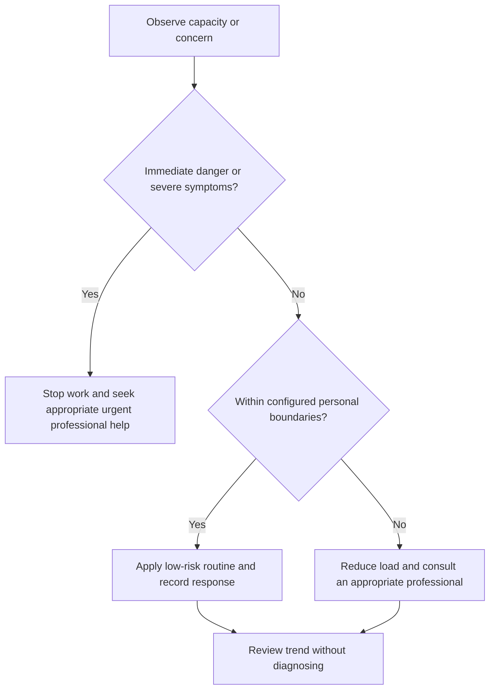

# Workspace Ergonomics and Visual Comfort

## Purpose

Configure study and engineering environments to reduce avoidable strain, hazards, and digital fatigue.

## Scope

This protocol is general workplace design, not diagnosis or treatment of pain, vision, or musculoskeletal conditions.

## Theory

Ergonomics fits work to the person through adjustability, task variation, safe equipment, and observation rather than enforcing one ideal posture.

## Scientific Basis

- **Evidence:** current registered public-health guidance or peer-reviewed
  evidence directly supporting a population-level claim.
- **Best practice:** conservative system design derived from evidence and local
  observation; it is not individualized clinical advice.
- **Opinion:** an operator preference recorded as configuration, not a health
  claim.

Relevant registered sources include `SRC-WHO-ACTIVITY-2020`, `SRC-WHO-DIET-2026`, `SRC-CDC-SLEEP`, and `SRC-WHO-STRESS-2020`. Individual needs vary with age,
health, disability, pregnancy, medication, environment, and professional advice.

## Framework

| Element | Operational rule |
|---|---|
| Chair/work surface | Stable, adjustable where possible, supports task |
| Display | Readable size, contrast, distance, and glare control |
| Input devices | Neutral comfortable reach and force |
| Posture | Supported variation rather than rigid holding |
| Vision | Regular distance changes, lighting control, current corrective care |
| Hardware lab | Electrical, thermal, cable, ventilation, and tool safety |
| Digital fatigue | Batch screen work and alternate task modes where feasible |

## Workflow

Inspect hazards; adjust one element; test representative tasks; observe discomfort and errors; vary posture and task; review; seek professional assessment for persistent symptoms.

## Implementation

Use photos or measurements only privately. Prefer inexpensive adjustments and task variation before purchasing equipment.

## Decision Tree

Stop work when symptoms impair safe operation or worsen rapidly; obtain appropriate occupational, vision, or medical advice.

## Failure Modes

Searching for a perfect posture, buying equipment without testing, working through numbness or severe pain, and neglecting electrical hazards.

## Recovery

Pause the task, remove hazards, change setup, reduce exposure, and seek qualified assessment for persistent or concerning symptoms.

## Examples

Raising a laptop may improve display position but requires a separate keyboard only if the resulting setup is comfortable and feasible.

## Tables

The framework table is normative. Sensitive observations belong in private
storage and are never used to diagnose a condition.

## Mermaid Diagrams

The decision tree places safety and professional escalation before productivity.

## Cross References

- [Study Environment](../04-study-system/README.md)
- [Physical Activity](physical-activity.md)
- [Escalation Boundaries](escalation-boundaries.md)

## References

- [Source register](../../references/source-register.yml)
- `SRC-WHO-ACTIVITY-2020`, `SRC-WHO-DIET-2026`, `SRC-CDC-SLEEP`, and `SRC-WHO-STRESS-2020`

## Further Reading

Consult current occupational-safety, vision-care, accessibility, and equipment guidance.

## Next Steps

Run a workspace inspection and record one testable adjustment.

## Acceptance Criteria

- [x] Educational and professional-care boundaries are explicit.
- [x] No diagnosis, treatment, supplement, or prescription instruction is given.
