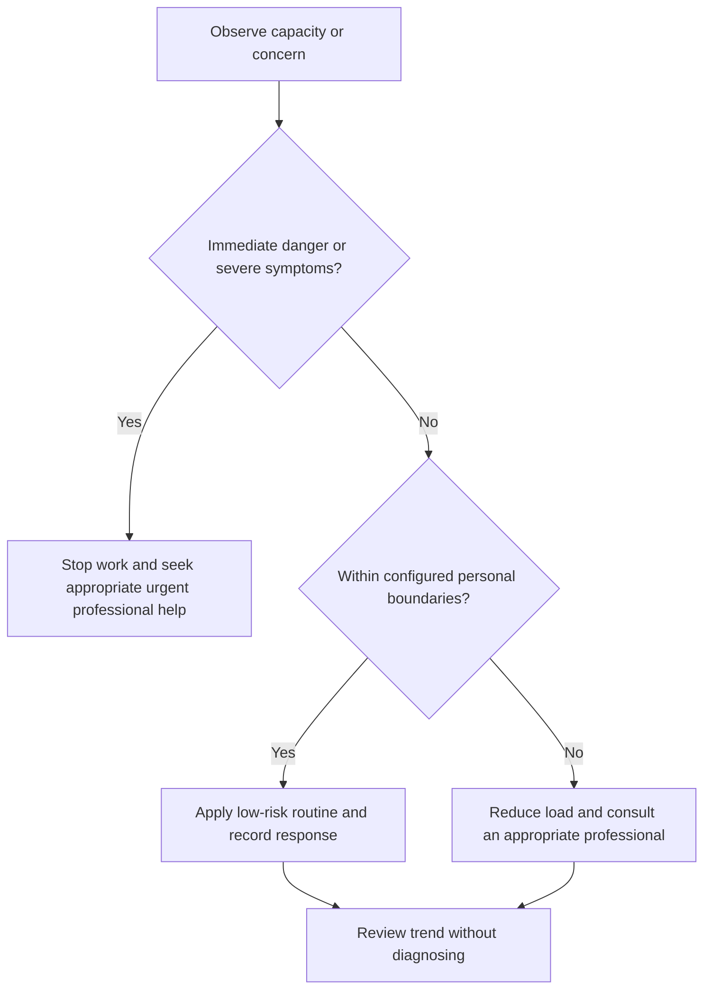

# Health Escalation Boundaries

## Purpose

Define when self-management stops and professional or urgent help becomes necessary.

## Scope

This file does not enumerate every symptom or replace local emergency guidance.

## Theory

Escalation protects safety when severity, persistence, uncertainty, medication issues, or functional impairment exceed a general self-management system.

## Scientific Basis

- **Evidence:** current registered public-health guidance or peer-reviewed
  evidence directly supporting a population-level claim.
- **Best practice:** conservative system design derived from evidence and local
  observation; it is not individualized clinical advice.
- **Opinion:** an operator preference recorded as configuration, not a health
  claim.

Relevant registered sources include `SRC-WHO-ACTIVITY-2020`, `SRC-WHO-DIET-2026`, `SRC-CDC-SLEEP`, and `SRC-WHO-STRESS-2020`. Individual needs vary with age,
health, disability, pregnancy, medication, environment, and professional advice.

## Framework

| Element | Operational rule |
|---|---|
| Immediate danger | Stop and use appropriate local emergency services or urgent care |
| Severe/rapid change | Seek prompt professional assessment |
| Persistent impairment | Arrange qualified healthcare review |
| Medication issue | Contact prescriber or pharmacist; do not alter independently |
| Mental-health risk | Use urgent professional help when safety is at risk |
| Uncertainty | Choose the safer escalation path |
| Campaign | Pause or reduce work without penalty |

## Workflow

Recognize trigger; make situation safe; contact appropriate help; provide concise relevant information; follow professional direction; record only planning status privately.

## Implementation

Configure local services and trusted contacts privately before need. Do not store sensitive contact or medical details publicly.

## Decision Tree

When immediate safety is uncertain, prioritize urgent professional evaluation over completing a checklist.

## Failure Modes

Searching online instead of obtaining urgent care, minimizing symptoms for deadlines, changing medication, and disclosing private details publicly.

## Recovery

Stop campaign activity, activate local support, follow qualified guidance, and resume only after safety and capacity are re-established.

## Examples

Concerning symptoms during equipment work trigger shutdown and appropriate care; the task is not transferred to a late-night catch-up block.

## Tables

The framework table is normative. Sensitive observations belong in private
storage and are never used to diagnose a condition.

## Mermaid Diagrams

The decision tree places safety and professional escalation before productivity.

## Cross References

- [Scope and Safety](scope-and-safety.md)
- [Professional Help Boundaries](../11-resilience-system/professional-help-boundaries.md)
- [Interruption Protocol](../03-execution-system/interruption-protocol.md)

## References

- [Source register](../../references/source-register.yml)
- `SRC-WHO-ACTIVITY-2020`, `SRC-WHO-DIET-2026`, `SRC-CDC-SLEEP`, and `SRC-WHO-STRESS-2020`

## Further Reading

Identify current local emergency and healthcare pathways privately with qualified guidance.

## Next Steps

Complete the private escalation plan.

## Acceptance Criteria

- [x] Educational and professional-care boundaries are explicit.
- [x] No diagnosis, treatment, supplement, or prescription instruction is given.
