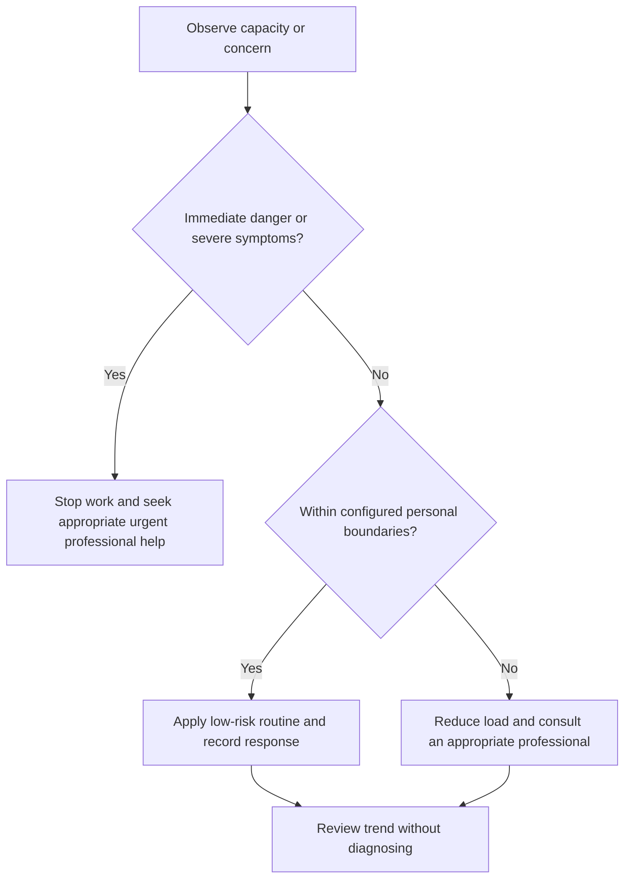

# Fatigue and Capacity Monitoring

## Purpose

Detect declining functional capacity early and trigger safe workload adjustment.

## Scope

The system records function and context; it does not diagnose burnout, depression, sleep disorders, or medical causes.

## Theory

Fatigue is multidimensional and imperfectly measured. Trends in attention, errors, recovery, and function are more useful for planning than a single score.

## Scientific Basis

- **Evidence:** current registered public-health guidance or peer-reviewed
  evidence directly supporting a population-level claim.
- **Best practice:** conservative system design derived from evidence and local
  observation; it is not individualized clinical advice.
- **Opinion:** an operator preference recorded as configuration, not a health
  claim.

Relevant registered sources include `SRC-WHO-ACTIVITY-2020`, `SRC-WHO-DIET-2026`, `SRC-CDC-SLEEP`, and `SRC-WHO-STRESS-2020`. Individual needs vary with age,
health, disability, pregnancy, medication, environment, and professional advice.

## Framework

| Element | Operational rule |
|---|---|
| Inputs | Sleep opportunity, workload, illness, activity, environment, stress |
| Function | Attention, reaction, comprehension, errors, motivation, physical comfort |
| Trend | Repeated change from personal baseline |
| Guardrail | Configured stop/reduce/escalate thresholds |
| Action | Continue, reduce, switch task, recover, or seek help |
| Privacy | Store observations privately and minimize detail |

## Workflow

Brief check before high-risk work; record function and context; compare with personal baseline; apply guardrail; close day; review trend weekly.

## Implementation

Use qualitative bands such as stable, reduced, impaired, or unsafe. Do not infer a medical cause from the band.

## Decision Tree

Unsafe function stops hazardous work. Persistent or worsening impairment triggers appropriate professional assessment.

## Failure Modes

Ignoring errors, using stimulants to override unsafe fatigue, collecting excessive data, and treating low energy as moral failure.

## Recovery

Reduce WIP, protect sleep and basic needs, switch to low-risk tasks if appropriate, pause, and obtain care when indicated.

## Examples

Repeated verification errors after poor sleep move hardware work to a later safe window and reduce the weekly load.

## Tables

The framework table is normative. Sensitive observations belong in private
storage and are never used to diagnose a condition.

## Mermaid Diagrams

The decision tree places safety and professional escalation before productivity.

## Cross References

- [Capacity Model](../02-roadmap/capacity-model.md)
- [Sleep Protocol](sleep-protocol.md)
- [Stress Observation](../11-resilience-system/stress-observation.md)

## References

- [Source register](../../references/source-register.yml)
- `SRC-WHO-ACTIVITY-2020`, `SRC-WHO-DIET-2026`, `SRC-CDC-SLEEP`, and `SRC-WHO-STRESS-2020`

## Further Reading

Consult current occupational-fatigue and clinical guidance for safety-critical contexts.

## Next Steps

Define private guardrails before the next high-attention work block.

## Acceptance Criteria

- [x] Educational and professional-care boundaries are explicit.
- [x] No diagnosis, treatment, supplement, or prescription instruction is given.
