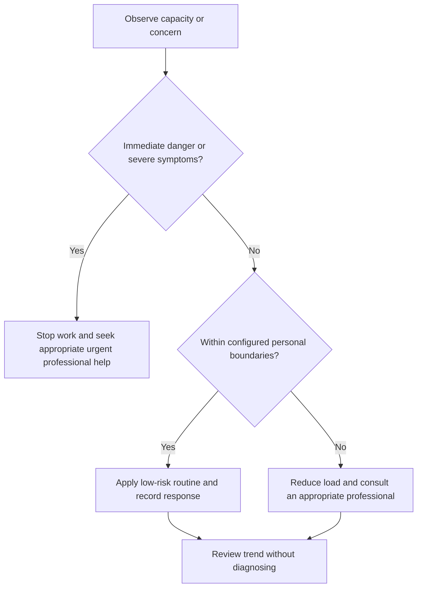

# Nutrition and Hydration Fundamentals

## Purpose

Support reliable access to food and fluids during engineering work using general, culturally adaptable principles.

## Scope

The protocol does not prescribe calories, macros, weight change, supplements, therapeutic diets, or fluid quantities.

## Theory

Healthy diet composition varies by individual and cultural context. Planning should emphasize adequacy, variety, food safety, access, and compatibility with professional guidance.

## Scientific Basis

- **Evidence:** current registered public-health guidance or peer-reviewed
  evidence directly supporting a population-level claim.
- **Best practice:** conservative system design derived from evidence and local
  observation; it is not individualized clinical advice.
- **Opinion:** an operator preference recorded as configuration, not a health
  claim.

Relevant registered sources include `SRC-WHO-ACTIVITY-2020`, `SRC-WHO-DIET-2026`, `SRC-CDC-SLEEP`, and `SRC-WHO-STRESS-2020`. Individual needs vary with age,
health, disability, pregnancy, medication, environment, and professional advice.

## Framework

| Element | Operational rule |
|---|---|
| Access | Regular opportunity for meals and fluids |
| Variety | Diverse foods consistent with culture, budget, availability, and needs |
| Safety | Storage, preparation, allergens, and contamination controls |
| Hydration | Access and individual cues; follow clinical restrictions |
| Constraints | Medical, ethical, religious, sensory, financial, and local |
| Tracking | Only when useful and non-harmful; private by default |

## Workflow

Identify access and constraints; plan simple options; prepare safely; make water or appropriate fluids accessible; observe energy and tolerance; seek professional advice for concerns.

## Implementation

Use current WHO and local guidance for general context. Dietitians or clinicians own individualized therapeutic decisions.

## Decision Tree

Escalate persistent appetite, swallowing, gastrointestinal, weight, hydration, or eating concerns to an appropriate professional.

## Failure Modes

Rigid food rules, supplement recommendations, copying online diets, ignoring food safety, and using caffeine or restriction to override fatigue.

## Recovery

Restore regular safe access, simplify choices, remove unsupported rules, and seek qualified care when concerns persist.

## Examples

A long lab day includes planned access to familiar safe food and fluids; it does not require a universal meal schedule.

## Tables

The framework table is normative. Sensitive observations belong in private
storage and are never used to diagnose a condition.

## Mermaid Diagrams

The decision tree places safety and professional escalation before productivity.

## Cross References

- [Fatigue Monitoring](fatigue-monitoring.md)
- [Scope and Safety](scope-and-safety.md)
- [Finance Constraints](../01-charter/constraints.md)

## References

- [Source register](../../references/source-register.yml)
- `SRC-WHO-ACTIVITY-2020`, `SRC-WHO-DIET-2026`, `SRC-CDC-SLEEP`, and `SRC-WHO-STRESS-2020`

## Further Reading

Consult the current WHO healthy-diet guidance and qualified local nutrition care where needed.

## Next Steps

Record only access constraints that affect campaign planning.

## Acceptance Criteria

- [x] Educational and professional-care boundaries are explicit.
- [x] No diagnosis, treatment, supplement, or prescription instruction is given.
