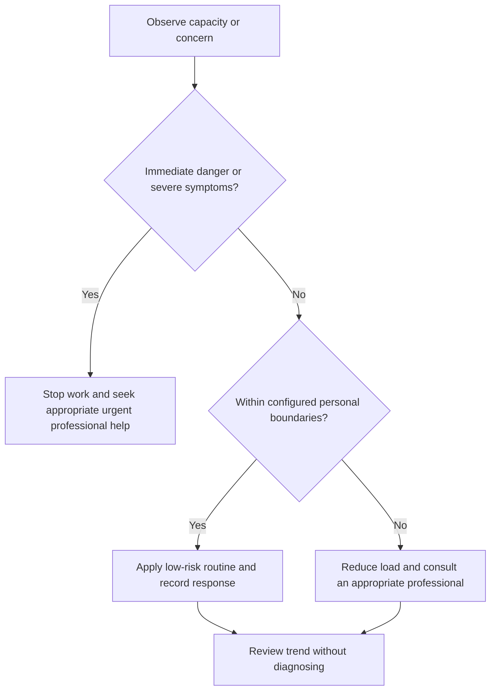

# Physical Activity and Mobility

## Purpose

Support general movement, strength, mobility, and reduced sedentary time within individual capability.

## Scope

This is not an individualized exercise prescription or rehabilitation plan.

## Theory

Population guidance supports regular activity and reduced sedentary behavior, while safe type, intensity, progression, and volume depend on individual context.

## Scientific Basis

- **Evidence:** current registered public-health guidance or peer-reviewed
  evidence directly supporting a population-level claim.
- **Best practice:** conservative system design derived from evidence and local
  observation; it is not individualized clinical advice.
- **Opinion:** an operator preference recorded as configuration, not a health
  claim.

Relevant registered sources include `SRC-WHO-ACTIVITY-2020`, `SRC-WHO-DIET-2026`, `SRC-CDC-SLEEP`, and `SRC-WHO-STRESS-2020`. Individual needs vary with age,
health, disability, pregnancy, medication, environment, and professional advice.

## Framework

| Element | Operational rule |
|---|---|
| Baseline | Current activity, limitations, symptoms, and professional restrictions |
| Modes | Aerobic, strengthening, balance, mobility, and daily movement as applicable |
| Progression | Gradual, observable, and reversible |
| Sedentary work | Regular posture and movement variation |
| Environment | Safe surface, equipment, temperature, hydration access |
| Stop/escalate | Pain, faintness, chest symptoms, unusual breathlessness, injury, or professional restriction |

## Workflow

Assess constraints; choose low-risk activity within capability; schedule; warm up as appropriate; observe response; recover; review trend; adjust or seek guidance.

## Implementation

Use current WHO or local guidance as population context and qualified professional advice for individual programming.

## Decision Tree

Stop when safety symptoms or injury concerns occur. Do not progress solely to meet a tracker target.

## Failure Modes

Abrupt increases, exercising through concerning symptoms, copying another person’s plan, and equating soreness with effectiveness.

## Recovery

Stop the provoking activity, reduce load, use appropriate professional assessment, and resume only within safe guidance.

## Examples

A study day includes brief movement variation and a preselected feasible activity window rather than an untested intense session.

## Tables

The framework table is normative. Sensitive observations belong in private
storage and are never used to diagnose a condition.

## Mermaid Diagrams

The decision tree places safety and professional escalation before productivity.

## Cross References

- [Ergonomics](ergonomics.md)
- [Fatigue Monitoring](fatigue-monitoring.md)
- [Capacity Model](../02-roadmap/capacity-model.md)

## References

- [Source register](../../references/source-register.yml)
- `SRC-WHO-ACTIVITY-2020`, `SRC-WHO-DIET-2026`, `SRC-CDC-SLEEP`, and `SRC-WHO-STRESS-2020`

## Further Reading

Consult WHO physical-activity guidance and current local or clinical advice relevant to the individual.

## Next Steps

Add feasible movement and activity windows to the weekly plan.

## Acceptance Criteria

- [x] Educational and professional-care boundaries are explicit.
- [x] No diagnosis, treatment, supplement, or prescription instruction is given.
