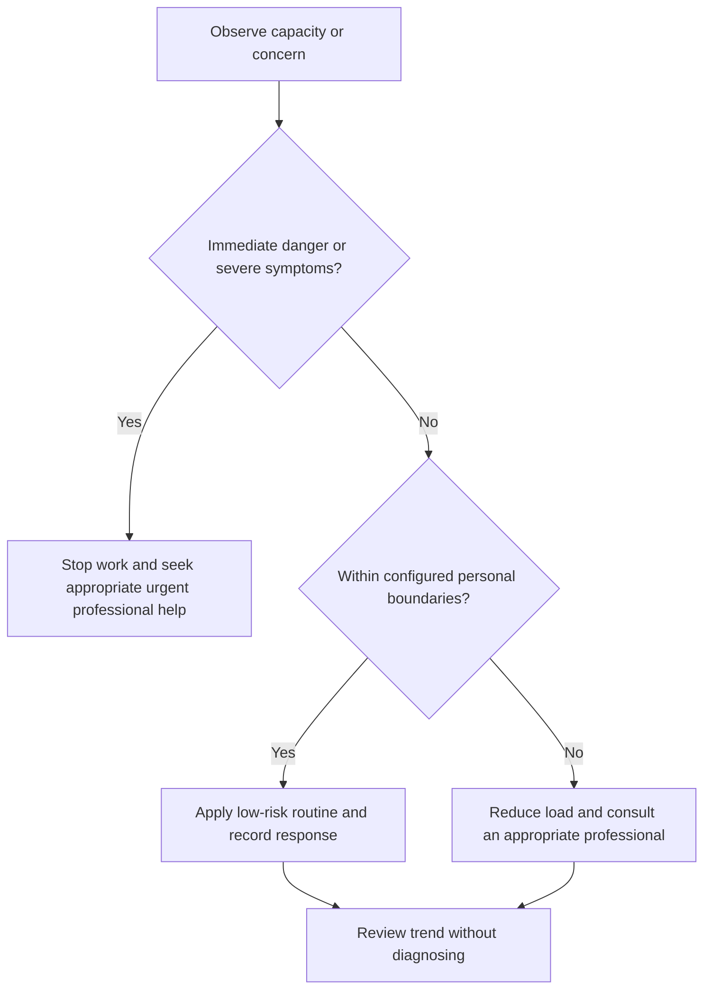

# Health Scope and Safety

## Purpose

Define the safe operating boundary for all Project Olympus health content.

## Scope

The module provides general education and planning controls only; clinical decisions belong to qualified professionals.

## Theory

A safe system separates population guidance, personal observations, and clinical decisions, and routes uncertainty to appropriate care.

## Scientific Basis

- **Evidence:** current registered public-health guidance or peer-reviewed
  evidence directly supporting a population-level claim.
- **Best practice:** conservative system design derived from evidence and local
  observation; it is not individualized clinical advice.
- **Opinion:** an operator preference recorded as configuration, not a health
  claim.

Relevant registered sources include `SRC-WHO-ACTIVITY-2020`, `SRC-WHO-DIET-2026`, `SRC-CDC-SLEEP`, and `SRC-WHO-STRESS-2020`. Individual needs vary with age,
health, disability, pregnancy, medication, environment, and professional advice.

## Framework

| Element | Operational rule |
|---|---|
| Allowed | General routines, environment checks, private observations, workload adjustment |
| Not allowed | Diagnosis, treatment, dosing, supplements, individualized exercise or diet plans |
| Medication tracking | Record adherence only to the existing prescribed plan |
| Medication decisions | Ask prescriber or pharmacist; never infer dose changes |
| Urgent concern | Stop activity and seek appropriate urgent help |
| Privacy | No public health, medication, or mental-health details |

## Workflow

Identify intended use; check for contraindications or professional restrictions; apply only low-risk general controls; observe; escalate uncertainty.

## Implementation

A medication adherence record may log scheduled/taken/missed status privately. For a missed dose, side effect, or uncertainty, follow the authorized label and contact the prescriber or pharmacist—do not improvise.

## Decision Tree

When symptoms are severe, rapidly worsening, dangerous, or impair safe functioning, stop campaign work and seek appropriate urgent professional help.

## Failure Modes

Using a tracker to alter medication, treating fatigue as laziness, delaying care to protect a schedule, and sharing personal records.

## Recovery

Suspend the affected protocol, preserve a concise symptom and medication record for the professional, and follow qualified guidance.

## Examples

A private reminder supports an existing prescription; it does not decide when or how much medication to take.

## Tables

The framework table is normative. Sensitive observations belong in private
storage and are never used to diagnose a condition.

## Mermaid Diagrams

The decision tree places safety and professional escalation before productivity.

## Cross References

- [Escalation Boundaries](escalation-boundaries.md)
- [Safety Policy](../../governance/safety-and-escalation-policy.md)
- [Constraints](../01-charter/constraints.md)

## References

- [Source register](../../references/source-register.yml)
- `SRC-WHO-ACTIVITY-2020`, `SRC-WHO-DIET-2026`, `SRC-CDC-SLEEP`, and `SRC-WHO-STRESS-2020`

## Further Reading

Use current local emergency, medication, and healthcare guidance supplied by qualified authorities.

## Next Steps

Configure private boundaries before tracking.

## Acceptance Criteria

- [x] Educational and professional-care boundaries are explicit.
- [x] No diagnosis, treatment, supplement, or prescription instruction is given.
