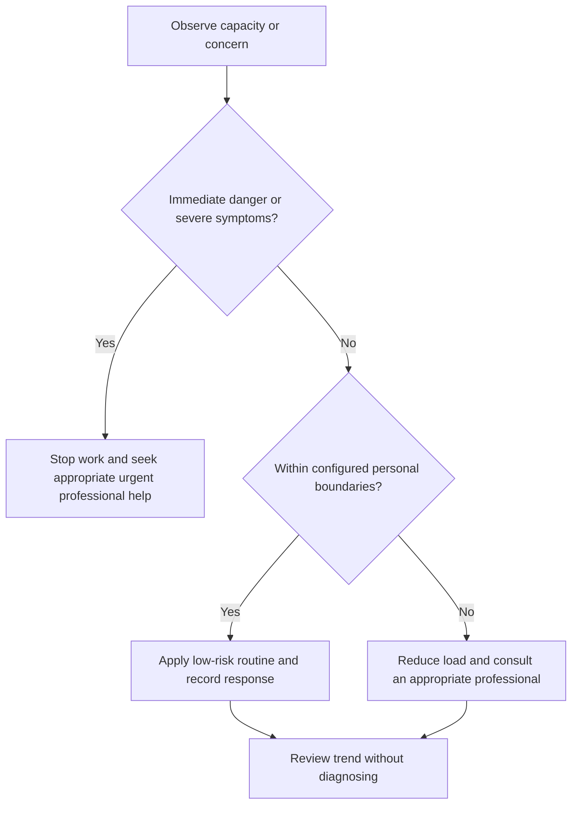

# Sleep and Recovery Protocol

## Purpose

Protect adequate sleep opportunity and observe sleep-related capacity without diagnosing sleep disorders.

## Scope

The protocol supports scheduling and escalation; it does not prescribe sleep treatment, aids, or medication.

## Theory

Sleep need varies, but regular adequate sleep opportunity and attention to persistent impairment are widely recognized health considerations.

## Scientific Basis

- **Evidence:** current registered public-health guidance or peer-reviewed
  evidence directly supporting a population-level claim.
- **Best practice:** conservative system design derived from evidence and local
  observation; it is not individualized clinical advice.
- **Opinion:** an operator preference recorded as configuration, not a health
  claim.

Relevant registered sources include `SRC-WHO-ACTIVITY-2020`, `SRC-WHO-DIET-2026`, `SRC-CDC-SLEEP`, and `SRC-WHO-STRESS-2020`. Individual needs vary with age,
health, disability, pregnancy, medication, environment, and professional advice.

## Framework

| Element | Operational rule |
|---|---|
| Opportunity | Protected interval derived from individual need and professional guidance |
| Schedule | Stable wake and sleep windows where feasible |
| Environment | Dark, quiet, comfortable, safe, and configurable |
| Inputs | Record relevant caffeine, screen, travel, and workload context without moral judgment |
| Outcome | Restoration and daytime function, not wearable score alone |
| Escalation | Persistent insomnia, excessive sleepiness, breathing concerns, or impaired safety |

## Workflow

Protect opportunity; prepare environment; end work at shutdown; observe timing and daytime function; review trend; adjust workload; seek care when boundaries trigger.

## Implementation

Use a brief private log for schedule, opportunity, awakenings if known, and daytime function. Wearables are optional estimates, not diagnoses.

## Decision Tree

Do not compensate chronic sleep loss with schedule compression or unqualified sleep products. Safety impairment triggers stopping hazardous work or driving.

## Failure Modes

Chasing a perfect score, sacrificing sleep for catch-up, rigid schedules during illness, and ignoring persistent impairment.

## Recovery

Reduce load, restore opportunity and environment, consult a qualified professional for persistent concerns, and ramp work only after function stabilizes.

## Examples

After several poorly functioning days, the weekly plan is reduced and professional advice is considered; missed tasks are not moved into the night.

## Tables

The framework table is normative. Sensitive observations belong in private
storage and are never used to diagnose a condition.

## Mermaid Diagrams

The decision tree places safety and professional escalation before productivity.

## Cross References

- [Shutdown Protocol](../03-execution-system/shutdown-protocol.md)
- [Fatigue Monitoring](fatigue-monitoring.md)
- [Escalation Boundaries](escalation-boundaries.md)

## References

- [Source register](../../references/source-register.yml)
- `SRC-WHO-ACTIVITY-2020`, `SRC-WHO-DIET-2026`, `SRC-CDC-SLEEP`, and `SRC-WHO-STRESS-2020`

## Further Reading

Review current sleep guidance from recognized health authorities and individual healthcare professionals.

## Next Steps

Integrate protected sleep opportunity into the capacity model.

## Acceptance Criteria

- [x] Educational and professional-care boundaries are explicit.
- [x] No diagnosis, treatment, supplement, or prescription instruction is given.
