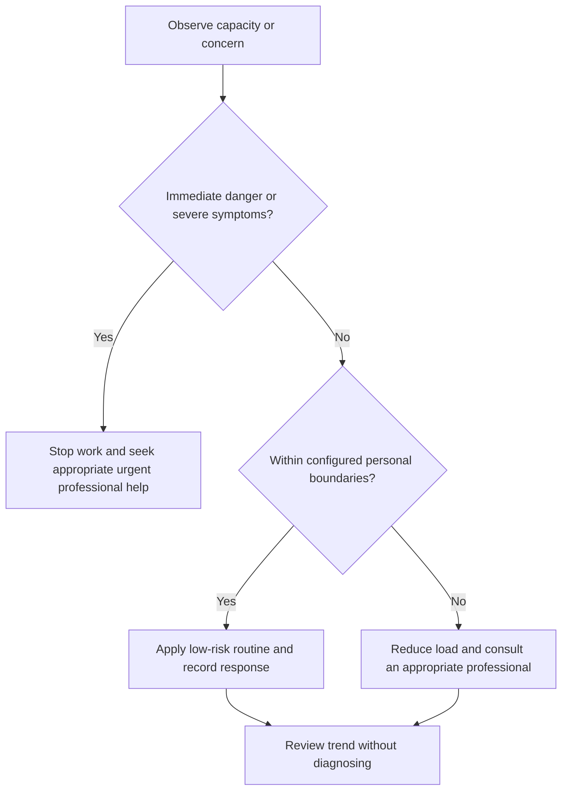

# Resilience System

## Purpose

Provide canonical navigation for stress observation, emotional skills, support, setback review, and professional-help boundaries.

## Scope

This educational system does not diagnose or treat mental-health conditions and is not crisis care.

## Theory

Resilience is the capacity to adapt, recover, and continue or change safely; it is not endurance of unlimited load or suppression of emotion.

## Scientific Basis

- **Evidence:** current registered public-health guidance or peer-reviewed
  evidence directly supporting a population-level claim.
- **Best practice:** conservative system design derived from evidence and local
  observation; it is not individualized clinical advice.
- **Opinion:** an operator preference recorded as configuration, not a health
  claim.

Relevant registered sources include `SRC-WHO-ACTIVITY-2020`, `SRC-WHO-DIET-2026`, `SRC-CDC-SLEEP`, and `SRC-WHO-STRESS-2020`. Individual needs vary with age,
health, disability, pregnancy, medication, environment, and professional advice.

## Framework

| Element | Operational rule |
|---|---|
| Observe | Stressors, responses, function, and context |
| Regulate | Low-risk skills and environmental change |
| Support | Trusted personal and professional network |
| Review | Evidence-based setback analysis |
| Adapt | Reduce scope, revise plan, or stop |
| Escalate | Professional help when safety or function requires |

## Workflow

Establish boundaries; observe stress; apply bounded skills; use support; review setbacks; recalibrate confidence; escalate when needed.

## Implementation

Keep observations private, short, and decision-oriented. Avoid assigning diagnostic labels.

## Decision Tree

Safety concerns or sustained functional decline override independent self-management.

## Failure Modes

Treating resilience as toughness, suppressing distress, isolation, overtracking mood, and continuing harmful load.

## Recovery

Reduce demands, restore support, seek professional help where appropriate, and restart only from observed capacity.

## Examples

After a failed interview, the operator reviews controllable preparation evidence without converting the outcome into an identity judgment.

## Tables

The framework table is normative. Sensitive observations belong in private
storage and are never used to diagnose a condition.

## Mermaid Diagrams

The decision tree places safety and professional escalation before productivity.

## Cross References

- [Scope and Safety](scope-and-safety.md)
- [Health System](../10-health-system/README.md)
- [Setback Review](setback-review.md)

## References

- [Source register](../../references/source-register.yml)
- `SRC-WHO-ACTIVITY-2020`, `SRC-WHO-DIET-2026`, `SRC-CDC-SLEEP`, and `SRC-WHO-STRESS-2020`

## Further Reading

Use current reputable stress-management and mental-health guidance appropriate to the individual.

## Next Steps

Read Scope and Safety before applying any resilience tool.

## Acceptance Criteria

- [x] Educational and professional-care boundaries are explicit.
- [x] No diagnosis, treatment, supplement, or prescription instruction is given.
