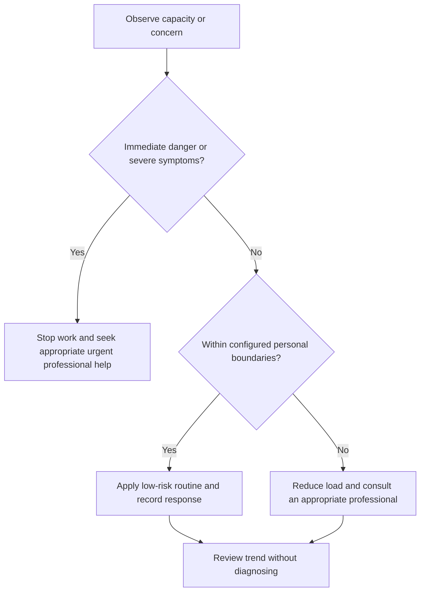

# Emotional Regulation Toolkit

## Purpose

Offer low-risk skills for pausing, orienting, choosing action, and reducing avoidable escalation during ordinary stress.

## Scope

The toolkit is not therapy and excludes trauma processing, exposure, or clinical intervention.

## Theory

Regulation does not mean eliminating emotion; it means creating enough space to act consistently with safety, values, and evidence.

## Scientific Basis

- **Evidence:** current registered public-health guidance or peer-reviewed
  evidence directly supporting a population-level claim.
- **Best practice:** conservative system design derived from evidence and local
  observation; it is not individualized clinical advice.
- **Opinion:** an operator preference recorded as configuration, not a health
  claim.

Relevant registered sources include `SRC-WHO-ACTIVITY-2020`, `SRC-WHO-DIET-2026`, `SRC-CDC-SLEEP`, and `SRC-WHO-STRESS-2020`. Individual needs vary with age,
health, disability, pregnancy, medication, environment, and professional advice.

## Framework

| Element | Operational rule |
|---|---|
| Orient | Notice surroundings and current task |
| Label | Use simple non-diagnostic emotion words |
| Ground | Attend to present sensory information |
| Pause | Delay irreversible decisions when safe |
| Reframe | Generate alternative evidence-consistent interpretations |
| Act | Choose one safe controllable step |
| Support | Contact a trusted or professional resource |

## Workflow

Check safety; pause; orient; label; choose one skill; observe whether function improves; take bounded action; stop or escalate if worse.

## Implementation

Practice skills during low-stress periods. Record only which action helped planning, not intimate narrative.

## Decision Tree

Do not use reframing to deny harm, override boundaries, or remain in unsafe situations.

## Failure Modes

Forcing positivity, debating emotions, using breathing techniques despite discomfort, and persisting when a skill worsens distress.

## Recovery

Stop the skill, return to environment and safety, use support, and seek professional guidance for persistent difficulty.

## Examples

Before replying to a critical message, pause, identify the factual request, draft later, and ask a trusted reviewer.

## Tables

The framework table is normative. Sensitive observations belong in private
storage and are never used to diagnose a condition.

## Mermaid Diagrams

The decision tree places safety and professional escalation before productivity.

## Cross References

- [Stress Observation](stress-observation.md)
- [Professional Correspondence](../09-communication-system/professional-correspondence.md)
- [Professional Help Boundaries](professional-help-boundaries.md)

## References

- [Source register](../../references/source-register.yml)
- `SRC-WHO-ACTIVITY-2020`, `SRC-WHO-DIET-2026`, `SRC-CDC-SLEEP`, and `SRC-WHO-STRESS-2020`

## Further Reading

Use reputable stress-management resources and individualized professional care when appropriate.

## Next Steps

Select one low-risk skill for routine practice.

## Acceptance Criteria

- [x] Educational and professional-care boundaries are explicit.
- [x] No diagnosis, treatment, supplement, or prescription instruction is given.
