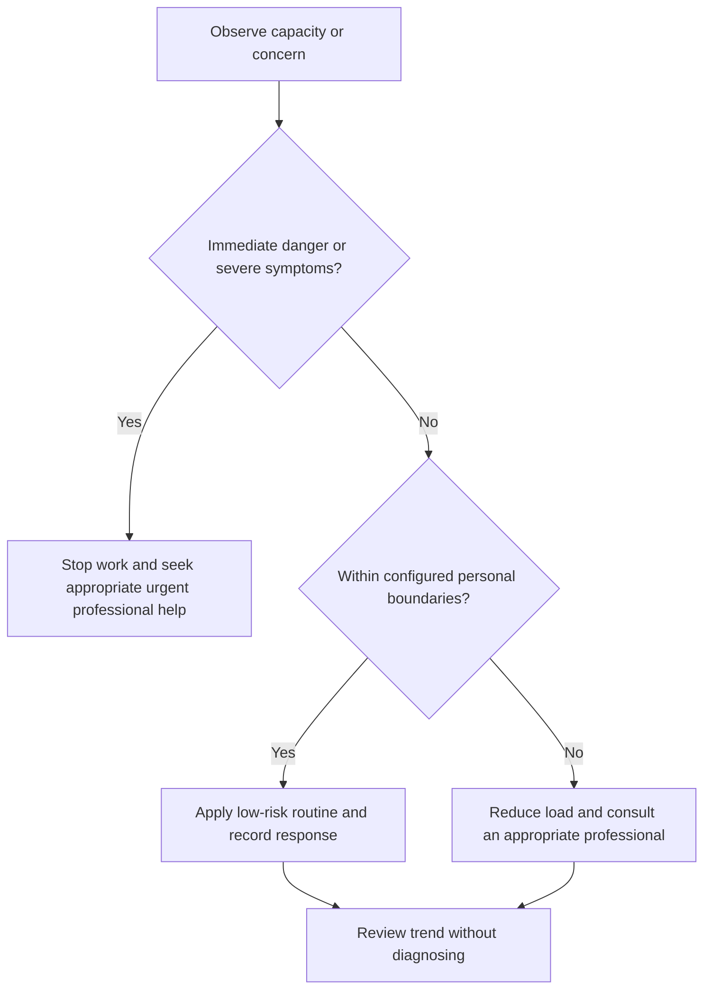

# Professional Help Boundaries

## Purpose

Define when and how to transition from self-management to qualified professional care.

## Scope

This document is not a diagnostic checklist and does not provide specific hotline or treatment instructions.

## Theory

Early appropriate help is a system response to risk, persistence, uncertainty, or functional impairment—not a failure of resilience.

## Scientific Basis

- **Evidence:** current registered public-health guidance or peer-reviewed
  evidence directly supporting a population-level claim.
- **Best practice:** conservative system design derived from evidence and local
  observation; it is not individualized clinical advice.
- **Opinion:** an operator preference recorded as configuration, not a health
  claim.

Relevant registered sources include `SRC-WHO-ACTIVITY-2020`, `SRC-WHO-DIET-2026`, `SRC-CDC-SLEEP`, and `SRC-WHO-STRESS-2020`. Individual needs vary with age,
health, disability, pregnancy, medication, environment, and professional advice.

## Framework

| Element | Operational rule |
|---|---|
| Urgent safety | Use appropriate local emergency or crisis services |
| Persistent distress | Arrange qualified mental-health or medical assessment |
| Functional decline | Seek help when sleep, work, care, or relationships are substantially impaired |
| Medication | Prescriber or pharmacist owns medication decisions |
| Scope | Coaches, peers, and mentors do not replace clinicians |
| Privacy | Share only necessary information through approved channels |
| Follow-through | Record appointment/action status, not clinical details, in campaign planning |

## Workflow

Recognize boundary; make situation safe; choose appropriate professional route; contact support; follow qualified advice; adjust campaign load.

## Implementation

Preconfigure local options privately. If a resource is unavailable, use the next appropriate professional or urgent pathway.

## Decision Tree

Safety concerns require urgent help. Uncertainty about danger should be resolved on the safer side.

## Failure Modes

Waiting for a crisis, asking unqualified peers for treatment, changing medication, and using work as avoidance.

## Recovery

Pause campaign demands, activate the support map, use appropriate professional services, and resume only within safe capacity.

## Examples

Persistent inability to concentrate and sleep prompts professional assessment and workload reduction rather than another focus technique.

## Tables

The framework table is normative. Sensitive observations belong in private
storage and are never used to diagnose a condition.

## Mermaid Diagrams

The decision tree places safety and professional escalation before productivity.

## Cross References

- [Scope and Safety](scope-and-safety.md)
- [Support Network](support-network.md)
- [Health Escalation](../10-health-system/escalation-boundaries.md)

## References

- [Source register](../../references/source-register.yml)
- `SRC-WHO-ACTIVITY-2020`, `SRC-WHO-DIET-2026`, `SRC-CDC-SLEEP`, and `SRC-WHO-STRESS-2020`

## Further Reading

Verify current local professional and urgent-care pathways; do not rely on stale contact information.

## Next Steps

Complete the private escalation and support plan.

## Acceptance Criteria

- [x] Educational and professional-care boundaries are explicit.
- [x] No diagnosis, treatment, supplement, or prescription instruction is given.
