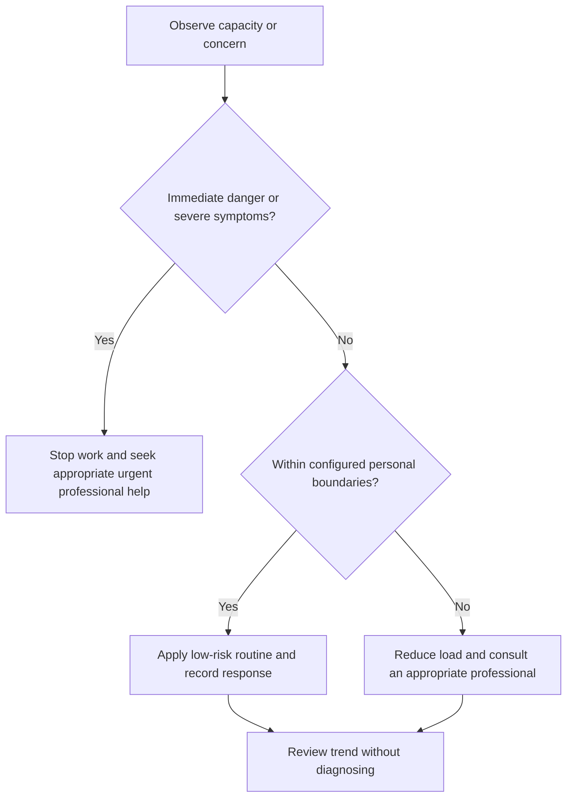

# Resilience Scope and Safety

## Purpose

Define educational, privacy, and escalation boundaries for resilience practices.

## Scope

The system supports reflection and planning; it does not provide psychotherapy, diagnosis, or emergency intervention.

## Theory

Low-risk self-management can support ordinary stress, but severe distress, safety concerns, or persistent impairment require appropriate professional care.

## Scientific Basis

- **Evidence:** current registered public-health guidance or peer-reviewed
  evidence directly supporting a population-level claim.
- **Best practice:** conservative system design derived from evidence and local
  observation; it is not individualized clinical advice.
- **Opinion:** an operator preference recorded as configuration, not a health
  claim.

Relevant registered sources include `SRC-WHO-ACTIVITY-2020`, `SRC-WHO-DIET-2026`, `SRC-CDC-SLEEP`, and `SRC-WHO-STRESS-2020`. Individual needs vary with age,
health, disability, pregnancy, medication, environment, and professional advice.

## Framework

| Element | Operational rule |
|---|---|
| Allowed | Observation, workload change, grounding, reflection, support planning |
| Not allowed | Diagnosis, treatment, exposure therapy, medication advice |
| Privacy | Minimal private records |
| Consent | Do not make others responsible without agreement |
| Escalation | Professional help for persistent impairment or safety concerns |
| Emergency | Use appropriate local urgent services |

## Workflow

Clarify intended use; check safety; choose a low-risk action; observe response; stop if worse; escalate as needed.

## Implementation

Configure local professional and emergency pathways privately. Do not rely on this repository during an emergency.

## Decision Tree

Any risk of harm, inability to stay safe, severe disorganization, or rapidly worsening distress requires urgent professional help.

## Failure Modes

Self-treatment, forced disclosure, using productivity coaching for clinical symptoms, and delaying care.

## Recovery

Stop the exercise, contact appropriate help, involve a trusted person when safe and consented, and suspend campaign demands.

## Examples

A short reflection is appropriate for routine disappointment; persistent inability to function warrants professional assessment.

## Tables

The framework table is normative. Sensitive observations belong in private
storage and are never used to diagnose a condition.

## Mermaid Diagrams

The decision tree places safety and professional escalation before productivity.

## Cross References

- [Professional Help Boundaries](professional-help-boundaries.md)
- [Health Escalation](../10-health-system/escalation-boundaries.md)
- [Safety Policy](../../governance/safety-and-escalation-policy.md)

## References

- [Source register](../../references/source-register.yml)
- `SRC-WHO-ACTIVITY-2020`, `SRC-WHO-DIET-2026`, `SRC-CDC-SLEEP`, and `SRC-WHO-STRESS-2020`

## Further Reading

Review current local mental-health and emergency guidance with a qualified professional when needed.

## Next Steps

Create a private support and escalation map.

## Acceptance Criteria

- [x] Educational and professional-care boundaries are explicit.
- [x] No diagnosis, treatment, supplement, or prescription instruction is given.
