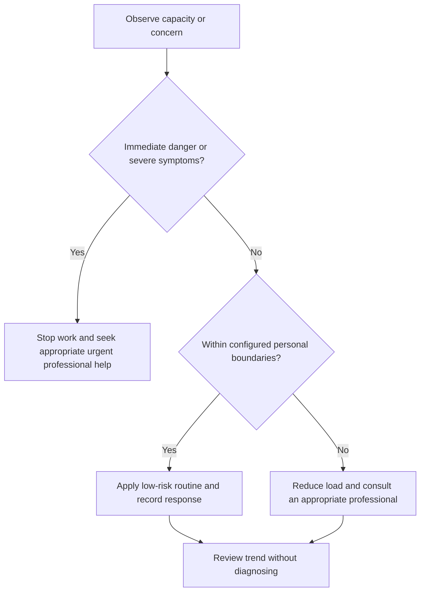

# Setback Review

## Purpose

Convert failures and disruptions into bounded decisions without shame or outcome bias.

## Scope

The review handles ordinary campaign setbacks; clinical distress and emergencies route to professional help.

## Theory

A setback contains observations, contributing conditions, controllable actions, uncertainty, and learning. It does not establish stable identity or ability.

## Scientific Basis

- **Evidence:** current registered public-health guidance or peer-reviewed
  evidence directly supporting a population-level claim.
- **Best practice:** conservative system design derived from evidence and local
  observation; it is not individualized clinical advice.
- **Opinion:** an operator preference recorded as configuration, not a health
  claim.

Relevant registered sources include `SRC-WHO-ACTIVITY-2020`, `SRC-WHO-DIET-2026`, `SRC-CDC-SLEEP`, and `SRC-WHO-STRESS-2020`. Individual needs vary with age,
health, disability, pregnancy, medication, environment, and professional advice.

## Framework

| Element | Operational rule |
|---|---|
| Event | What occurred and expected baseline |
| Evidence | Artifacts, timing, conditions, feedback |
| Contributors | Knowledge, process, capacity, interface, external conditions |
| Control | Controllable, influenceable, uncontrollable |
| Decision | Continue, change, reduce, pause, stop, escalate |
| Prevention | One testable system change |
| Confidence | Prediction compared with evidence |

## Workflow

Stabilize; collect evidence; separate fact and interpretation; classify causes; identify control; choose one corrective action; schedule review.

## Implementation

Keep the review short and link to canonical evidence. Do not repeatedly relive the event.

## Decision Tree

When setback response impairs safety or functioning, stop the review and seek appropriate support.

## Failure Modes

Self-blame, hindsight certainty, rewriting goals, changing many systems, and immediate overcompensation.

## Recovery

Return to observed facts, reduce load, restore recovery, choose one reversible change, and reassess after evidence.

## Examples

A failed exam practice set leads to error classification and sequence change, not a conclusion that the operator cannot learn.

## Tables

The framework table is normative. Sensitive observations belong in private
storage and are never used to diagnose a condition.

## Mermaid Diagrams

The decision tree places safety and professional escalation before productivity.

## Cross References

- [Controllables](../01-charter/controllables-vs-outcomes.md)
- [Error Log](../04-study-system/error-log-protocol.md)
- [Project Postmortem](../07-project-system/postmortem.md)

## References

- [Source register](../../references/source-register.yml)
- `SRC-WHO-ACTIVITY-2020`, `SRC-WHO-DIET-2026`, `SRC-CDC-SLEEP`, and `SRC-WHO-STRESS-2020`

## Further Reading

Consult professional support if setbacks repeatedly trigger severe or persistent distress.

## Next Steps

Record the next bounded action and review date.

## Acceptance Criteria

- [x] Educational and professional-care boundaries are explicit.
- [x] No diagnosis, treatment, supplement, or prescription instruction is given.
