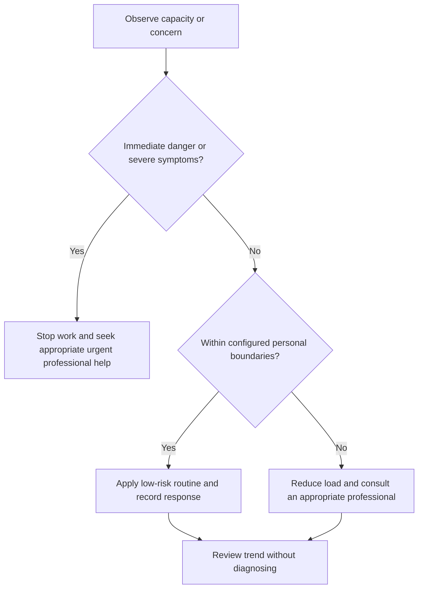

# Stress Observation

## Purpose

Observe stressors, responses, and functional impact without diagnosing.

## Scope

This protocol supports ordinary planning and early escalation, not clinical assessment.

## Theory

Stress responses vary. Separating event, interpretation, body response, behavior, and function can reveal controllable changes without declaring a disorder.

## Scientific Basis

- **Evidence:** current registered public-health guidance or peer-reviewed
  evidence directly supporting a population-level claim.
- **Best practice:** conservative system design derived from evidence and local
  observation; it is not individualized clinical advice.
- **Opinion:** an operator preference recorded as configuration, not a health
  claim.

Relevant registered sources include `SRC-WHO-ACTIVITY-2020`, `SRC-WHO-DIET-2026`, `SRC-CDC-SLEEP`, and `SRC-WHO-STRESS-2020`. Individual needs vary with age,
health, disability, pregnancy, medication, environment, and professional advice.

## Framework

| Element | Operational rule |
|---|---|
| Event | Observable demand or uncertainty |
| Interpretation | Current meaning or prediction |
| Response | Emotional, cognitive, behavioral, physical observations |
| Function | Effect on sleep, attention, work, relationships, safety |
| Control | What can be changed, influenced, or accepted |
| Trend | Duration, recurrence, worsening, recovery |

## Workflow

Pause; name event; record brief observations; assess function and safety; choose environmental, workload, support, or skill response; review later.

## Implementation

Use neutral language and qualitative bands. Do not turn a self-rating into a diagnosis.

## Decision Tree

Escalate when distress is severe, persistent, worsening, safety-related, or substantially impairs daily function.

## Failure Modes

Ruminative logging, scoring every feeling, blaming character, and ignoring environmental causes.

## Recovery

Shorten the record, focus on one controllable change, use support, and seek professional help when boundaries trigger.

## Examples

A deadline collision is separated into fixed obligations, predicted consequences, physical tension, and the decision to reduce campaign scope.

## Tables

The framework table is normative. Sensitive observations belong in private
storage and are never used to diagnose a condition.

## Mermaid Diagrams

The decision tree places safety and professional escalation before productivity.

## Cross References

- [Emotional Regulation Toolkit](emotional-regulation-toolkit.md)
- [Fatigue Monitoring](../10-health-system/fatigue-monitoring.md)
- [Controllables](../01-charter/controllables-vs-outcomes.md)

## References

- [Source register](../../references/source-register.yml)
- `SRC-WHO-ACTIVITY-2020`, `SRC-WHO-DIET-2026`, `SRC-CDC-SLEEP`, and `SRC-WHO-STRESS-2020`

## Further Reading

Consult WHO stress-management material and current professional guidance.

## Next Steps

Choose the lowest-risk response appropriate to the observation.

## Acceptance Criteria

- [x] Educational and professional-care boundaries are explicit.
- [x] No diagnosis, treatment, supplement, or prescription instruction is given.
