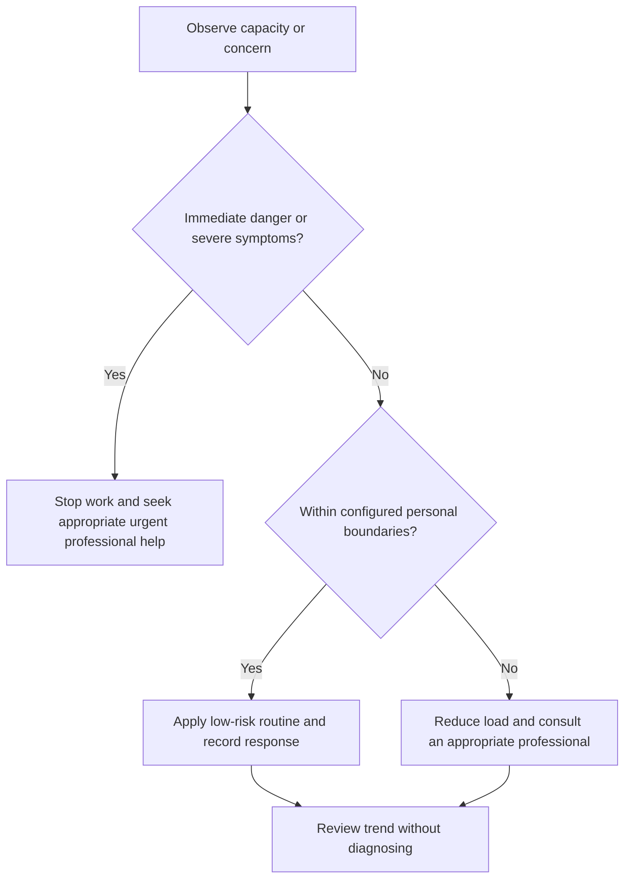

# Support Network Mapping

## Purpose

Map consented personal, academic, workplace, healthcare, and emergency support pathways.

## Scope

The map does not guarantee availability and must remain private and current.

## Theory

Different needs require different roles; relying on one person for every type of support is fragile and may violate boundaries.

## Scientific Basis

- **Evidence:** current registered public-health guidance or peer-reviewed
  evidence directly supporting a population-level claim.
- **Best practice:** conservative system design derived from evidence and local
  observation; it is not individualized clinical advice.
- **Opinion:** an operator preference recorded as configuration, not a health
  claim.

Relevant registered sources include `SRC-WHO-ACTIVITY-2020`, `SRC-WHO-DIET-2026`, `SRC-CDC-SLEEP`, and `SRC-WHO-STRESS-2020`. Individual needs vary with age,
health, disability, pregnancy, medication, environment, and professional advice.

## Framework

| Element | Operational rule |
|---|---|
| Practical | Logistics, transport, meals, temporary task help |
| Emotional | Listening and connection with consent |
| Technical | Mentor, reviewer, instructor, colleague |
| Professional | Qualified healthcare or counseling |
| Emergency | Current local urgent services |
| Boundary | What each person has agreed to provide |
| Fallback | Alternative if unavailable |

## Workflow

List needs; identify appropriate roles; ask consent; record preferred contact method privately; verify periodically; use the least intrusive suitable pathway.

## Implementation

Store no unnecessary personal details. Never publish private contacts in the repository.

## Decision Tree

Use professional or emergency routes when the need exceeds a personal contact’s role or safety is at risk.

## Failure Modes

Assuming consent, overloading one person, treating peers as clinicians, and using stale emergency information.

## Recovery

Apologize and repair boundaries, diversify roles, verify professional pathways, and update private records.

## Examples

A project mentor reviews architecture; a friend offers companionship; neither is assigned clinical responsibility.

## Tables

The framework table is normative. Sensitive observations belong in private
storage and are never used to diagnose a condition.

## Mermaid Diagrams

The decision tree places safety and professional escalation before productivity.

## Cross References

- [Professional Help Boundaries](professional-help-boundaries.md)
- [Advisor Communication](../08-research-system/advisor-communication.md)
- [Interruption Protocol](../03-execution-system/interruption-protocol.md)

## References

- [Source register](../../references/source-register.yml)
- `SRC-WHO-ACTIVITY-2020`, `SRC-WHO-DIET-2026`, `SRC-CDC-SLEEP`, and `SRC-WHO-STRESS-2020`

## Further Reading

Verify current local healthcare and emergency pathways privately.

## Next Steps

Create the minimum private support map.

## Acceptance Criteria

- [x] Educational and professional-care boundaries are explicit.
- [x] No diagnosis, treatment, supplement, or prescription instruction is given.
